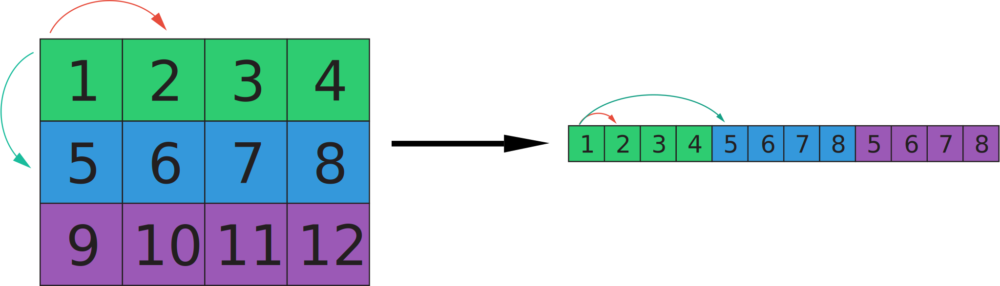
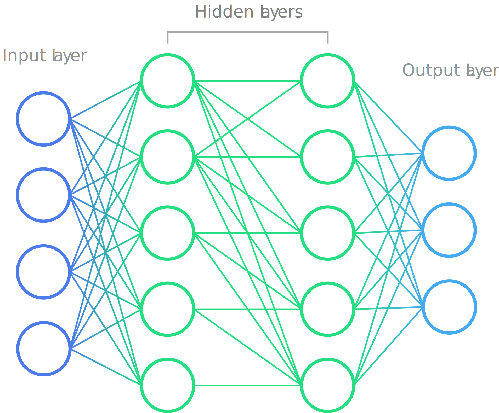

# Goal

The goal of this thesis is to lay the theoretical foundation for implementing a conversational AI system from first principles.
This conversational AI system requested by the client (Higher Technical College St. Pölten) is aimed to be used in the context of a chatbot for the purpose of providing information about the school.
To explore the low-level mathematical foundations of this problem to a deeper extent, a library for accelerating the
tensor processing operations commonplace in deep learning was developed. Note that this library will not be used in the final project,
but rather a tool to help explore the problem, as the writing a production-ready and fully featured tensor processing library requires a lot of
time and resources, usually only available to large organisations such as Google, Facebook, and Microsoft.
The library will be open source and available on GitHub under the MIT license. The library is written in Java, while some native code is used for hardware-specific acceleration,
such as the Intel MKL library for matrix multiplication on x86 CPUs, and the Apple Accelerate framework on Apple Silicon CPUs, as well as the CUDA toolkit for NVIDIA GPUs.
The library is designed with a focus on readability with shallow levels of abstraction in order to not obfuscate the underlying mathematics.
Besides these vendor-specific libraries, the library is written in pure Java and does not use any other third-party libraries.

# Overview

In the course of this thesis, we will express the problem of conversational AI as a mathematical problem.
Concepts will be introduced from first principles and the layers of abstraction traversed from the low-level mathematical foundations to the high-level concept that is a conversational AI system.

To start, a definition for 'learning' in the machine learning context will be layed out, and the concept of a neural network will be introduced as an example of a system learning in such fashion.
The concept of a tensor will be introduced, which is a generalisation of a vector and a matrix and is the fundamental data structure in deep learning.
While neural networks in their raw form of sufficient complexity are considered universal function approximators, architectures with intent to speed up the learning process in light of the task-specific problem structure are introduced.
The concept of a recurrent neural network will be introduced as an example of such an architecture, as a way to handle sequential data, while also focusing on their shortcomings.
The concept of a transformer will be introduced as a way to overcome the shortcomings of recurrent neural networks.
Lastly, we will introduce the concept of language models, which are a special case of transformers, as well the concept of a chatbot, which is a special case of language models.


# Definition of 'Learning'

Learning is a concept that is used in many different contexts, but in the context of machine learning, it is defined as the process of approximating an unknown function that maps an input to an output.
This approximation will be derived from a set of examples called the training data, where each example $(X, Y)$ is a pair of an input $X$, also called the feature vector, and an output $Y$, also referred to as the label.
The goal of the learning process is to find a function $f(x)$, also known as the model $m(x)$, that maps the input $X$ to the output $Y$, but specifically a function that will be able to map inputs $X$ to outputs $Y$ in a generalizing fashion, meaning that the
function will be able to map inputs $X$ to the correct outputs $Y$ that were not part of the set of examples used to derive the function.
Thus, from now on, we will refer to the term generalization as the predictive capability of the model $m(x)$ beyond the set of examples used to derive the function as well as the predictive capability of the function $m(x)$
for inputs $X$ outside the proximity of the set of examples used to derive the function. While for problems of low complexity, "proximity" in this context can be equated to distance metrics such as the Euclidean distance,
an arbitrarily complex problem $P(X)$ has no inherent distance metric, as whether two inputs $(X1, X2)$ are considered similar in the context of the problem is determined by the nature of the problem itself.
Thus, the concept of "proximity" shall not be a mathematical term, but rather a colloquial term for what a reasonable interpeter of the problem would consider to be similar inputs.

# Tensors

## Definition of a Tensor
A tensor is a generalisation of a vector and a matrix, and is the fundamental data structure in deep learning.
In its most general case a tensor $T$ of rank $n$ can be denoted as $T \in \mathbb{R}^{n_1 \times n_2 \times \dots \times n_n}$, where $n_i$ is the length of the $i-$th dimension of the tensor.
A tensor is a special case of multi-dimensional array of numbers or other primitives where for all elements of dimension $n$, the length is equivalent.
Thus the following condition is impossible in the constraints of a tensor: `array[n][0].length != array[n][1].length`.


### Shape and Rank
Given the constraint of a tensor compared to general multi-dimensional arrays, the shape of the tensor can be defined as a tuple of integers, where each element represents the length of the corresponding dimension.
Eg. the shape of a tensor with dimensions of length 2, 3 and 4 is $(2, 3, 4)$, where the first dimension is the most significant dimension and the last dimension is the least significant dimension, meaning that $4$ is a dimension of scalars.
The number of indices required to access a single scalar element from a given tensor is called the rank of the tensor, and is equivalent to the number of dimensions of the tensor. The rank of a tensor is not to be confused with the rank of a matrix in linear algebra, where the rank of a matrix is the number of linearly independent columns or rows.
Tensors of rank `0` are scalar tensors, vectors can be represented as tensors of rank `1` and matrices can be represented as tensors of rank `2`.


### Denoting a tensor with a specific multiset of values
A scalar tensor will be denoted indistinguishably as a numeric/primitive value, such as $3.14$, $-2$ or `true`.
A tensor of rank 1 will be denoted as a vector, such as $\begin{bmatrix} 1 & 2 & 3 \end{bmatrix}$, while tensors of rank two will be denoted as matrices, such as $\begin{bmatrix} 1 & 2 & 3 \\ 4 & 5 & 6 \end{bmatrix}$.
Tensors of higher ranks will only be denoted in array notation, such as `[[[1, 2, 3], [4, 5, 6]], [[7, 8, 9], [10, 11, 12]]]`.

### Indexing
Indexing into a tensor will be denoted as $T_{i_1i_2 \space \dots \space i_n }$ where n is the number of dimensions to index into. When all dimensions are indexed into, meaning $n$ is equal to the rank of the tensor, the result is a scalar value, otherwise the result is another tensor of rank $n - k$ where $k$ is the number of dimensions indexed into.

## Implementing a Tensor
While java has built-in support for multidimensional arrays, they are unsuitable for purposes of deep learning in a multitude of ways.
Firstly, given that java is a strongly typed language, the type of the elements of the array and the dimensionality of the array must be specified explicitly, making arrays unwieldy given that functions processing tensors should be able to operate largely independenly of the data type and dimensionality of the input tensor.

Secondly, accelerating tensor operation with hardware-specific optimizations is made difficult by the inability to control how tensor data is stored on a low level when using a language-intrinsic feature, resulting in unnecessary copies of data when operations are performed via an accelerator that is not the CPU, or even outside the JVM, which is an unnecessarily costly operation.

Thus SciCore defines its own `ITensor` interface that is implemented in different backends depending on the specific hardware acceleration that is requested.
Although each implementation differs ever so slightly in the way it is implemented on the given hardware, all implementations follow a similar pattern of storing the contents of the tensor in memory.

### Tensor Data Storage and shape-general Indexing
The data of a tensor is stored in a one-dimensional array of primitive values.

This one-dimensional array is then indexed via what we will now refer to as a "flat index". The flat index is the index of the element in the one-dimensional array that corresponds to the element in the tensor that is indexed by the multi-dimensional index. To calculate the flat index, we will be introducing a new concept called "strides".

#### Strides
The strides of a tensor is a tuple of integers, where each element at index $n$ represents the number of elements that must be skipped in the one-dimensional array to get to the next element in the corresponding dimension $n$.
Eg. the strides of a tensor with shape $(2, 3, 4)$ is $(12, 4, 1)$.
On the third dimension that is the scalar dimension of $4$ elements, to iterate to the next element, we skip $1$ element in the flat array, on the second dimension of $3$ elements, we skip $4$ elements in the flat array to get to the next element, and on the first dimension of $2$ elements, we skip $12$ elements in the flat array to get to the next element.

The following graphic illustrates the strides of a tensor with the shape $(3, 4)$ and the strides $(4, 1)$.
Note how iterating 4 elements in the flat array corresponds to iterating 1 element in the first dimension,
and iterating 1 element in the flat array corresponds to iterating 1 element in the second (scalar-level) dimension.



Strides are derived from the shape of the tensor, and are calculated as follows:

```java
public static long[] makeStrides(long[] shape) {        
    long[] strides = new long[shape.length];
    strides[strides.length - 1] = 1;
    for (int dim = shape.length - 2; dim >= 0; dim--){
        strides[dim] = strides[dim + 1] * shape[dim + 1];
    }
    return strides;
}
```
We start by creating an array of strides of the same length as the shape of the tensor, and set the last element of the strides array to 1.
Then we iterate over the dimensions of the tensor in reverse order, and for each dimension, we set the stride of the current dimension equal to the stride of the last dimension multiplied by the length of the last dimension.

#### Flat Indexing
Given the strides of a tensor, we can now calculate the flat index of an element in the tensor given its multi-dimensional index. This is acomplished by multiplying $strides_n$ * $index_n$ for all $n$ in the range $0$ to $rank - 1$ and summing the results.

```java
public static long getFlatIndex(long[] index, long[] strides) {
    long flatIndex = 0;
    for (int dim = 0; dim < index.length; dim++) {
        flatIndex += index[dim] * strides[dim];
    }
    return flatIndex;
}
```

#### Access Elements of Tensors
To access scalar values in the tensor, the multi-dimensional index supplied to the access method must be of the same length as the rank of the tensor.
The method will then calculate the flat index of the element in the tensor that corresponds to the supplied multi-dimensional index, and return the value at that index in the one-dimensional array.
When using a type-agnostic buffer, we must multiply the flat index by the size of the primitive type of the tensor to get the final byte offset into the buffer.

To show how this is accomplished in SciCore, the following excerpts from the source code will be shown:

```java
public class GenCPUTensor {
    ...
    @Override
    public int getInt(long[] indices) {
        long index = ShapeUtils.getFlatIndex(indices, this.strides);
        return this.dataContainer.getInt32Flat(index);
    }
    ...
}
```
```java
public class GenCPUDataContainer {
    ...
    private final DirectMemoryHandle memoryHandle;
    ...
        long nBytes = dataType.getSizeOf(nElements);
        this.memoryHandle = memoryManager.calloc(nBytes);
    ...
    public int getInt32Flat(long flatIndex) {
        long finalPtr = memoryHandle.getNativePtr() + flatIndex * Integer.BYTES;
        return MemoryUtil.memGetInt(finalPtr);
    }
    ...
}
```

To perform a write instead of a read, the same index calculation is performed, and the value is written to the calculated index in the one-dimensional array.

```java
public class GenCPUTensor {
    ...
    @Override
    public void setInt(long[] indices, int value) {
        long index = ShapeUtils.getFlatIndex(indices, this.strides);
        this.dataContainer.setInt32Flat(index, value);
    }
    ...
}
```

```java
public class GenCPUDataContainer {
    ...
    public void setInt32Flat(int value, long flatIndex) {
        long finalPtr = memoryHandle.getNativePtr() + flatIndex * 4;
        MemoryUtil.memPutInt(finalPtr, value);
    }
    ...
```


# Neural Networks
Neural networks are a class of machine learning models inspired by the human brain.
The human brain is composed of neurons, which are interconnected and communicate with each other via electrical signals. The signals are sent from one neuron to another via synapses, which are the connections between neurons. Wether a neuron fires or not is determined by the strengths of the signals it receives from the neurons it is connected to.

## Artificial Neurons
We can create a primitive model of a neuron by defining a function that takes a set of inputs and returns a single output. The most common model model of a neuron sums these inputs and applies a non-linear function to the sum, called the activation function $\sigma(x)$. Generally, any non-linear function can be used as an activation function, but in practice functions are chosen that have desirable properties, such as how easy it is to calculate the derivative of the function, or how it transforms the real number line $\mathbb{R}$.
The output of such a neuron is called the activation of the neuron, and is denoted as $a$.
Generally, the activation of a neuron is defined as:
$$
a = \sigma(\sum_{i=1}^{n} w_i x_i + b)
$$
where $w_i$ is the weight of the $i$th input, $x_i$ is the $i$th input, and $b$ is the bias of the neuron.
Each input can be thought of as a connection from another neuron, and the weight scales the influence of that connection to the output activation of the neuron. The bias can be thought of as a constant input to the neuron used to shift the activation of the neuron.
The weights $w$ and the bias $b$ are the parameters of the neuron and their specific values determine the behavior of the neuron and thus how it responds to inputs. The weights and bias are adjusted during training.

## Artificial Neural Networks
Artificial neural networks are composed of multiple such neurons, generally organized in layers in a fully-connected manner, meaning that each neuron in one layer is connected to every neuron in the next layer.
Generally, artificial neural networks consist of an input layer, one or more hidden layers, and an output layer.
The input layer is composed of neurons that take in the input data that the network should work with, and the output layer is composed of neurons hold the prediction and thus the output of the network. The hidden layers are the set of neurons that perform the actual computation of the network.



The number of hidden layers and the number of neurons in each layer are hyperparameters of the network, and are chosen based on the problem at hand.
Generally, the more complex the problem, the more hidden layers and neurons are needed to solve it. Given that with each additional layer, a non-linearity is added to the activations, the number of hidden layers thus determines the complexity of the function that the network can approximate. Eg. a network with one hidden layer can only approximate linear functions, but would fail to approximate a parabola. For more complex task, there is no obvious answer on what the appropriate number of hidden layers and neurons is, and it is often determined by trial and error.