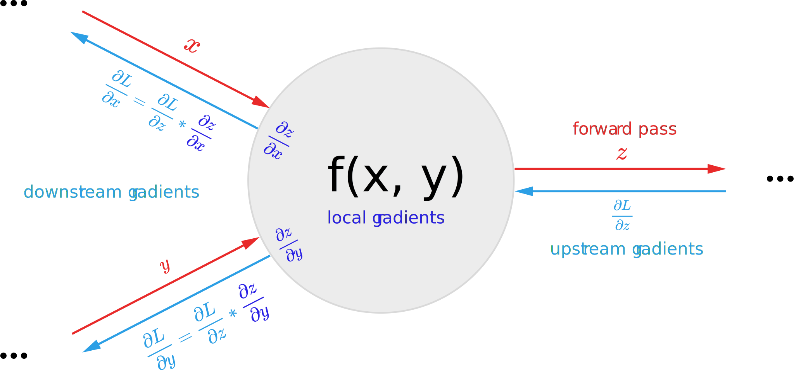
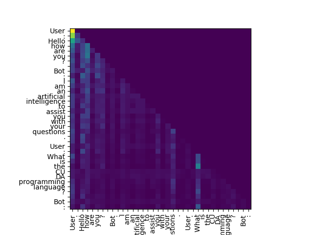

# Goal

The goal of this thesis is to lay the theoretical foundation for implementing a conversational AI system from first principles.
This conversational AI system requested by the client (Higher Technical College St. Pölten) is aimed to be used in the context of a chatbot for the purpose of providing information about the school.
To explore the low-level mathematical foundations of this problem to a deeper extent, a library for accelerating the
tensor processing operations commonplace in deep learning was developed. Note that this library will not be used in the final project,
but rather a tool to help explore the problem, as the writing a production-ready and fully featured tensor processing library requires a lot of
time and resources, usually only available to large organisations such as Google, Facebook, and Microsoft.
The library will be open source and available on GitHub under the MIT license. The library is written in Java, while some native code is used for hardware-specific acceleration,
such as the Intel MKL library for matrix multiplication on x86 CPUs, and the Apple Accelerate framework on Apple Silicon CPUs, as well as the CUDA toolkit for NVIDIA GPUs.
The library is designed with a focus on readability with shallow levels of abstraction in order to not obfuscate the underlying mathematics.
Besides these vendor-specific libraries, the library is written in pure Java and does not use any other third-party libraries.

# Overview

In the course of this thesis, we will express the problem of conversational AI as a mathematical problem.
Concepts will be introduced from first principles and the layers of abstraction traversed from the low-level mathematical foundations to the high-level concept that is a conversational AI system.

To start, a definition for 'learning' in the machine learning context will be layed out, and the concept of a neural network will be introduced as an example of a system learning in such fashion.
The concept of a tensor will be introduced, which is a generalisation of a vector and a matrix and is the fundamental data structure in deep learning.
While neural networks in their raw form of sufficient complexity are considered universal function approximators, architectures with intent to speed up the learning process in light of the task-specific problem structure are introduced.
The concept of a recurrent neural network will be introduced as an example of such an architecture, as a way to handle sequential data, while also focusing on their shortcomings.
The concept of a transformer will be introduced as a way to overcome the shortcomings of recurrent neural networks.
Lastly, we will introduce the concept of language models, as well the concept of a chatbot, which is a special case of language models.

<div style="page-break-after: always;"></div>


# Definition of 'Learning'

Learning is a concept that is used in many different contexts, but in the context of machine learning, it is defined as the process of approximating an unknown function that maps an input to an output.
This approximation will be derived from a set of examples called the training data, where each example $(X, Y)$ is a pair of an input $X$, also called the feature vector, and an output $Y$, also referred to as the label.
The goal of the learning process is to find a function $f(x)$, also known as the model $m(x)$, that maps the input $X$ to the output $Y$, but specifically a function that will be able to map inputs $X$ to outputs $Y$ in a generalizing fashion, meaning that the
function will be able to map inputs $X$ to the correct outputs $Y$ that were not part of the set of examples used to derive the function.
Thus, from now on, we will refer to the term generalization as the predictive capability of the model $m(x)$ beyond the set of examples used to derive the function as well as the predictive capability of the function $m(x)$
for inputs $X$ outside the proximity of the set of examples used to derive the function. While for problems of low complexity, "proximity" in this context can be equated to distance metrics such as the Euclidean distance,
an arbitrarily complex problem $P(X)$ has no inherent distance metric, as whether two inputs $(X1, X2)$ are considered similar in the context of the problem is determined by the nature of the problem itself.
Thus, the concept of "proximity" shall not be a mathematical term, but rather a colloquial term for what a reasonable interpeter of the problem would consider to be similar inputs.

# Tensors

## Definition of a Tensor
A tensor is a generalisation of a vector and a matrix, and is the fundamental data structure in deep learning.
In its most general case a tensor $T$ of rank $n$ can be denoted as $T \in \mathbb{R}^{n_1 \times n_2 \times \dots \times n_n}$, where $n_i$ is the length of the $i$-th dimension of the tensor.
A tensor is a special case of multi-dimensional array of numbers or other primitives where for all elements of dimension $n$, the length is equivalent.
Thus the following condition is impossible in the constraints of a tensor: `array[n][0].length != array[n][1].length`.


### Shape and Rank
Given the constraint of a tensor compared to general multi-dimensional arrays, the shape of the tensor can be defined as a tuple of integers, where each element represents the length of the corresponding dimension.
Eg. the shape of a tensor with dimensions of length 2, 3 and 4 is $(2, 3, 4)$, where the first dimension is the most significant dimension and the last dimension is the least significant dimension, meaning that $4$ is a dimension of scalars.
The number of indices required to access a single scalar element from a given tensor is called the rank of the tensor, and is equivalent to the number of dimensions of the tensor. The rank of a tensor is not to be confused with the rank of a matrix in linear algebra, where the rank of a matrix is the number of linearly independent columns or rows.
Tensors of rank `0` are scalar tensors, vectors can be represented as tensors of rank `1` and matrices can be represented as tensors of rank `2`.


### Denoting a tensor with a specific multiset of values
A scalar tensor will be denoted indistinguishably as a numeric/primitive value, such as $3.14$, $-2$ or `true`.
A tensor of rank 1 will be denoted as a vector, such as $\begin{bmatrix} 1 & 2 & 3 \end{bmatrix}$, while tensors of rank two will be denoted as matrices, such as $\begin{bmatrix} 1 & 2 & 3 \\ 4 & 5 & 6 \end{bmatrix}$.
Tensors of higher ranks will only be denoted in array notation, such as `[[[1, 2, 3], [4, 5, 6]], [[7, 8, 9], [10, 11, 12]]]`.

### Indexing
Indexing into a tensor will be denoted as $T_{i_1i_2 \space \dots \space i_n }$ where n is the number of dimensions to index into. When all dimensions are indexed into, meaning $n$ is equal to the rank of the tensor, the result is a scalar value, otherwise the result is another tensor of rank $n - k$ where $k$ is the number of dimensions indexed into.

## Implementing the Tensor data structure
While java has built-in support for multidimensional arrays, they are unsuitable for purposes of deep learning in a multitude of ways.
Firstly, given that java is a strongly typed language, the type of the elements of the array and the dimensionality of the array must be specified explicitly, making arrays unwieldy given that functions processing tensors should be able to operate largely independenly of the data type and dimensionality of the input tensor.

Secondly, accelerating tensor operation with hardware-specific optimizations is made difficult by the inability to control how tensor data is stored on a low level when using a language-intrinsic feature, resulting in unnecessary copies of data when operations are performed via an accelerator that is not the CPU, or even outside the JVM, which is an unnecessarily costly operation.

Thus SciCore defines its own `ITensor` interface that is implemented in different backends depending on the specific hardware acceleration that is requested.
Although each implementation differs ever so slightly in the way it is implemented on the given hardware, all implementations follow a similar pattern of storing the contents of the tensor in memory.

### Tensor Data Storage and shape-general Indexing
The data of a tensor is stored in a one-dimensional array of primitive values.

This one-dimensional array is then indexed via what we will now refer to as a "flat index". The flat index is the index of the element in the one-dimensional array that corresponds to the element in the tensor that is indexed by the multi-dimensional index. To calculate the flat index, we will be introducing a new concept called "strides".

#### Strides
The strides of a tensor is a tuple of integers, where each element at index $n$ represents the number of elements that must be skipped in the one-dimensional array to get to the next element in the corresponding dimension $n$.
Eg. the strides of a tensor with shape $(2, 3, 4)$ is $(12, 4, 1)$.
On the third dimension that is the scalar dimension of $4$ elements, to iterate to the next element, we skip $1$ element in the flat array, on the second dimension of $3$ elements, we skip $4$ elements in the flat array to get to the next element, and on the first dimension of $2$ elements, we skip $12$ elements in the flat array to get to the next element.

The following graphic illustrates the strides of a tensor with the shape $(3, 4)$ and the strides $(4, 1)$.
Note how iterating 4 elements in the flat array corresponds to iterating 1 element in the first dimension,
and iterating 1 element in the flat array corresponds to iterating 1 element in the second (scalar-level) dimension.


Strides are derived from the shape of the tensor, and are calculated as follows:

```java
public static long[] makeStrides(long[] shape) {        
    long[] strides = new long[shape.length];
    strides[strides.length - 1] = 1;
    for (int dim = shape.length - 2; dim >= 0; dim--){
        strides[dim] = strides[dim + 1] * shape[dim + 1];
    }
    return strides;
}
```
We start by creating an array of strides of the same length as the shape of the tensor, and set the last element of the strides array to 1.
Then we iterate over the dimensions of the tensor in reverse order, and for each dimension, we set the stride of the current dimension equal to the stride of the last dimension multiplied by the length of the last dimension.

#### Flat Indexing
Given the strides of a tensor, we can now calculate the flat index of an element in the tensor given its multi-dimensional index. This is acomplished by multiplying $strides_n$ * $index_n$ for all $n$ in the range $0$ to $rank - 1$ and summing the results.

```java
public static long getFlatIndex(long[] index, long[] strides) {
    long flatIndex = 0;
    for (int dim = 0; dim < index.length; dim++) {
        flatIndex += index[dim] * strides[dim];
    }
    return flatIndex;
}
```

#### Access Elements of Tensors
To access scalar values in the tensor, the multi-dimensional index supplied to the access method must be of the same length as the rank of the tensor.
The method will then calculate the flat index of the element in the tensor that corresponds to the supplied multi-dimensional index, and return the value at that index in the one-dimensional array.
When using a type-agnostic buffer, we must multiply the flat index by the size of the primitive type of the tensor to get the final byte offset into the buffer.

To show how this is accomplished in SciCore, the following excerpts from the source code will be shown:

```java
public class GenCPUTensor {
    ...
    @Override
    public int getInt(long[] indices) {
        long index = ShapeUtils.getFlatIndex(indices, this.strides);
        return this.dataContainer.getInt32Flat(index);
    }
    ...
}
```
```java
public class GenCPUDataContainer {
    ...
    private final DirectMemoryHandle memoryHandle;
    ...
        long nBytes = dataType.getSizeOf(nElements);
        this.memoryHandle = memoryManager.calloc(nBytes);
    ...
    public int getInt32Flat(long flatIndex) {
        long finalPtr = memoryHandle.getNativePtr() + flatIndex * 4;
        return MemoryUtil.memGetInt(finalPtr);
    }
    ...
}
```

To perform a write instead of a read, the same index calculation is performed, and the value is written to the calculated index in the one-dimensional array.

```java
public class GenCPUTensor {
    ...
    @Override
    public void setInt(long[] indices, int value) {
        long index = ShapeUtils.getFlatIndex(indices, this.strides);
        this.dataContainer.setInt32Flat(index, value);
    }
    ...
}
```

```java
public class GenCPUDataContainer {
    ...
    public void setInt32Flat(int value, long flatIndex) {
        long finalPtr = memoryHandle.getNativePtr() + flatIndex * 4;
        MemoryUtil.memPutInt(finalPtr, value);
    }
    ...
```

## Mathematical operations on tensors

To perform mathematical operations on tensors, we have to implement a well-defined operator that takes one or more tensors as operands and returns a tensor as a result.
Operators are categorized by the number of operands they accept into unary, binary, etc. operators.

### Unary operators
For unary operators, the result tensor is of the same shape as the operand tensor, and the result of the operation can thus be computed by iterating over the elements of the operand tensor in an element-wise fashion and performing the operation on each element, while respecting the strides of the operand tensor.

As an example, we take the `exp` operator, which takes a tensor as an operand and returns a tensor with the same shape as the operand, where each element is the $e^x$ of the corresponding element in the operand tensor.

```java
public class JvmExpOp ... {
    ...
    public ITensor perform(Graph.IOperationContext ctx, ITensor input) {
        long[] shape = input.getShape();
        long[] strides = input.getStrides();
        long nElements = ShapeUtils.getNumElements(shape);
        DataType dataType = input.getDataType();
        ITensor result = backend.createTensor(dataType, shape);
        for (long i = 0; i < nElements; i++) {
            double value = input.getAsDoubleFlat(i);
            result.setByDoubleFlat(Math.exp(value), i);
        }
        result = result.getReshapedView(shape, strides);
        ...
        return result;
    }
    ...
}
```
Note that the strides of the operand tensor are not used to iterate over the elements of the tensor, keeping the implementation simple and fast.
The result is then reinterpreted with the strides of the operand tensor, so that the result tensor has the same strides as the operand tensor.
This way, element order across dimensions is preserved. This comes at the cost of not reordering the elements in the underlying storage of the tensor to a potentially more cache-friendly order, which could slow down subsequent operations performed on the resulting tensor.

An alternative solution would be to iterate over elements of the operand tensor in the order of the strides, and thus reordering the elements in the result tensor in the process. Note that the cache-friendliness of the result tensor comes at the cost of the operation itself being cache-unfriendly, when application of strides results in sequential or non-spatially contiguous access to the elements of the operand tensor in the underlying storage memory.


### Binary operators
To perform binary operations on tensors, such as addition, multiplication, etc., we need a robust way to handle the operands differing in shape.
In the trivial case, where both operands have the same shape, the operation can be performed element-wise, and the result is a tensor with the same shape as the operands.
However, when the operands differ in shape, we need a way to handle the mismatch.
Broadcasting is a concept that is used to handle this case.

#### Broadcasting
Broadcasting is a concept that allows tensors of different shapes to be used in binary operations.
To motivate the need for broadcasting, consider the following example:

```java
ITensor a = sciCore.array(new float[]{1, 2, 3, 4, 5});
ITensor b = sciCore.scalar(2f);

ITensor c = a.multiply(b);
```

The result of the multiplication $C = A * B$ is a tensor with the same shape as $A$, where each element is the product of the corresponding element in $A$ and $B$.
But note that the shape of $B$ is a scalar, while the shape of $A$ is a vector.
Figuratively speaking, we can imagine the scalar $B$ being stretched to the shape of $A$ to match the shape of $A$.

<p align="center">
    
</p>
While we could define tensor by scalar multiplication as its own case - which is certanly something to consider for optimization purposes, it is more convenient to view it as a special case of tensor by tensor multiplication under application of the broadcasting rules.

In the general case, the broadcasting rules are as follows:
The dimensions of the shape of both operands are compared from the last dimension (the rightmost dimension) to the first dimension (the leftmost dimension).
Dimensions are compared in pairs, and the following rules are applied:
1. If both dimensions are equal, the dimension in the output shape stays the same.
2. If one of the dimensions is 1, the dimension in the output shape is the same as the dimension in the other operand respectively.
3. If no pair can be constructed because one of the operands has lower rank than the other, the lower ranked operand is prepended with dimensions of size 1 until the ranks match.

The following code snippet implements the broadcasting rules to compute the shape of the resulting tensor of a binary operation:
```java
public static long[] broadcastShapes(long[] shapeA, long[] shapeB) {
    long[] broadcastShape = new long[shapeA.length];
    for (int i = 0; i < shapeA.length; i++) {
        long elementA = shapeA[shapeA.length - 1 - i];
        long elementB = i < shapeB.length ? shapeB[shapeB.length - 1 - i] : 1;
        long dimSize;
        if (elementA == elementB || elementB == 1) {
            dimSize = elementA;
        } else if (elementA == 1) {
            dimSize = elementB;
        } else {
            throw new IllegalArgumentException(
                    "Shapes are not broadcast-able: shapeA: " 
                    + ShapeUtils.toString(shapeA) +
                    ", shapeB: " + ShapeUtils.toString(shapeB)
            );
        }
        broadcastShape[broadcastShape.length - 1 - i] = dimSize;
    }
    return broadcastShape;
}
```
When a dimension is stretched to match the shape of the other operand, the elements of said dimensions are repeated to fill the dimension.
Note that if we were to actually make copies of the elements, the operation would be very memory wasteful, as the same information would be stored multiple times.
As can be seen in the above figure, the tensor $B$ is expanded to match the shape of $A$ by repeating the elements of $B$ along the first dimension, which would involve making
four additional copies of the element $2$. While not fatal for small tensors, this would be a very wasteful operation for large tensors.
Instead, we can "virtually extend" the shape of $B$ to the desired shape.

##### Virtually extended Tensors
Virtually extended tensors can be implemented in a multitude of ways.
Firstly, we can set the stride of a stretched dimension to zero. This way, advancing to the next element in the stretched dimension will result in the same element being accessed.
However, n-dimensional general index computation is a comparitively expensive operation, and we would like to avoid it as much as possible.
Thus we want to derive specialized solutions for indexing problems whenever possible.
We will thus introduce the terminology of "index constraining", meaning to restrict possible indices to a subset of the full dimension space.
In the case of stretched dimensions, we can constrain the indices of a stretched dimension to an index range of size 1.
The following code snippet implements the index calculation to map the `outputIndex`, which is a dimensional index into the result tensor of the operation, to the corresponding index in the operand tensor, which should be employed for element-whise operation.
```cpp
size_t getFlatIndexConstrained(const size_t *outputIndex,
                                const size_t *shape, const size_t *strides,
                                size_t nDims, size_t nDimsOut) {
    assert(nDims <= nDimsOut);
    size_t nNewDims = nDimsOut - nDims;
    size_t flatIndex = 0;
    for (size_t dim = 0; dim < nDims; dim++) {
        size_t stride = strides[dim];
        flatIndex += (outputIndex[dim + nNewDims] % shape[dim]) * stride;
    }
    return flatIndex;
}
```

Eg. in the binary multiplication operation, the method is used as follows:
```cpp
template<typename A, typename B, typename C>
void tblas_multiply(const A *a, const B *b, C *c,
                    size_t *shapeA, size_t *stridesA, size_t nDimsA,
                    size_t *shapeB, size_t *stridesB, size_t nDimsB,
                    size_t *shapeC, size_t *stridesC, size_t nDimsC) {
    auto *outputIndex = new size_t[nDimsC];
    memset(outputIndex, 0, sizeof(size_t) * nDimsC);

    size_t cIndexFlat = 0;
    do {
        size_t aIndexFlat = getFlatIndexConstrained(
                                outputIndex,
                                shapeA, stridesA, nDimsA,
                                nDimsC
                            );
        size_t bIndexFlat = getFlatIndexConstrained(
                                outputIndex,
                                shapeB, `stridesB, nDimsB,
                                nDimsC
                            );
        c[cIndexFlat] = a[aIndexFlat] * b[bIndexFlat];
        cIndexFlat++;
    } while (incrementIndex(outputIndex, shapeC, nDimsC));
    delete[] outputIndex;
}
```

# Neural Networks
Neural networks are a class of machine learning models inspired by the human brain.
The human brain is composed of neurons, which are interconnected and communicate with each other via electrical signals. The signals are sent from one neuron to another via synapses, which are the connections between neurons. Wether a neuron fires or not is determined by the strengths of the signals it receives from the neurons it is connected to.

## Artificial Neurons
We can create a primitive model of a neuron by defining a function that takes a set of inputs and returns a single output. The most common model model of a neuron sums these inputs and applies a non-linear function to the sum, called the activation function $g(x)$. Generally, any non-linear function can be used as an activation function, but in practice functions are chosen that have desirable properties, such as how easy it is to calculate the derivative of the function, or how it transforms the real number line $\mathbb{R}$.
The output of such a neuron is called the activation of the neuron, and is denoted as $a$.
Generally, the activation of a neuron is defined as:
$$
a = g(\sum_{i=1}^{n} w_i x_i + b)
$$
where $w_i$ is the weight of the $i$-th input, $x_i$ is the $i$-th input, and $b$ is the bias of the neuron.
Each input can be thought of as a connection from another neuron, and the weight scales the influence of that connection to the output activation of the neuron. The bias can be thought of as a constant input to the neuron used to shift the activation of the neuron.
The weights $w$ and the bias $b$ are the parameters of the neuron and their specific values determine the behavior of the neuron and thus how it responds to inputs. The weights and bias are adjusted during training.

## Artificial Neural Networks
Artificial neural networks are composed of multiple such neurons, generally organized in layers in a fully-connected manner, meaning that each neuron in one layer is connected to every neuron in the next layer.
Generally, artificial neural networks consist of an input layer, one or more hidden layers, and an output layer.
The input layer is composed of neurons that take in the input data that the network should work with, and the output layer is composed of neurons hold the prediction and thus the output of the network. The hidden layers are the set of neurons that perform the actual computation of the network.

<p align="center">
    
</p>

The number of hidden layers and the number of neurons in each layer are hyperparameters of the network, and are chosen based on the problem at hand.
Generally, the more complex the problem, the more hidden layers and neurons are needed to solve it. Given that with each additional layer, a non-linearity is added to the activations, the number of hidden layers thus determines the complexity of the function that the network can approximate. Eg. a network with one hidden layer can only approximate linear functions, but would fail to approximate a parabola. For more complex task, there is no obvious answer on what the appropriate number of hidden layers and neurons is, and it is often determined by trial and error.

The general activation for a multi-layer neural network is defined as:

$$
a_j^{[l]} = g^{[l]}(\sum_{k=1}^{n^{[l-1]}} w_{jk}^{[l]} a_k^{[l-1]} + b_j^{[l]})
$$

where $a_j^{[l]}$ is the activation of the $l$-th layer of the $j$-th neuron, $g^{[l]}$ is the activation function of the $l$-th layer, $w^{[l]}$ is the weight matrix of the $l$-th layer, $b_j^{[l]}$ is the bias of the 
$j$-th neuron of the $l$-th layer, and $n^{[l-1]}$ is the number of neurons in the previous layer.
The weight matrix is organized such that the weight at $w_{jk}$ is the weight of the connection from the $k$-th neuron of the previous layer to the $j$-th neuron of the current layer.


An astude observer might notice that this is mathematcally equivalent to the definition of a matrix multiplication, and indeed, the activation of a layer can be calculated as a matrix multiplication/dot product of the activations of the previous layer and the weight matrix of the current layer, plus the bias vector of the current layer:

$$
a^{[l]} = g^{[l]}(W^{[l]}\times a^{[l-1]} + b^{[l]})
$$


## ANNs in Deep Learning Frameworks

In modern deep learning frameworks, neural networks are typically represented as so-called "modules", which implement the so-called "forward pass", which is a function that takes the input data and propagates it through the network and returns the final output of the network. The deeplearning framework usually also provides modules for common neural network layers, such as a fully-connected layer. This allows the user to easily build complex neural networks by combining these modules by passing the output of one module as the input to another module in the forward pass.
A fully-connected layer is usually refered to as a `Dense` or `Linear` layer.
The `Linear` layer is such a module, and thus it implements the `forward` method, which takes the input data and returns the output of the layer. The `forward` method of the `Linear` layer is a simple matrix multiplication, equivalent to the mathematical definition above. The weights and bias are initialized uniformly between $\mathcal{U}(-\sqrt{k}, \sqrt{k})$ where $k=\frac{n}{in\_features}$. This is the so-called Xavier initialization, which a "commonly used heuristic" to initialize weights in neural networks. *(Xavier Glorot, Yoshua Bengio - 2010)* It aims to keep the variance of the activations of the layer constant, which is desirable as it prevents the activations from exploding or vanishing. But note that even though this is commonly used heuristic, it is only that - a heuristic and not a mathematically proven method. In fact, simple testing reveals, that only after a few layers the variance of the activations can shrink drastically, to the point where lack floating point precision destabilizes gradient descent and the network fails to train. We will discuss gradient descent in further detail in a later chapter.

Note that the usage of a bias is optional and can be disabled by setting the `bias` parameter to `false`.
The following snippet shows releveant parts of the implementation of the `Linear` module.

```java
public class Linear implements IModule {
    ...
    private final ITensor weights;

    @Nullable
    private final ITensor bias;

    ...

        float k = (float) (1.0 / Math.sqrt(inputSize));
        this.weights = sciCore
            .uniform(dataType, outputSize, inputSize)
            .multiply(2 * k)
            .minus(k);
        if (useBias) {
            this.bias = sciCore
                .uniform(dataType, outputSize)
                .multiply(2 * k)
                .minus(k);
        } else {
            this.bias = null;
        }

    ...

    @Override
    public ITensor forward(ITensor input) {
        ...
        ITensor x = input.matmul(weights.transpose());
        if (bias != null) {
            x = x.plus(bias);
        }
        return x;
    }
    ...
}
```

In SciCore, the `Linear` layer can be used as follows:

```java
class BobNet implements IModule {

    private final Sigmoid act = new Sigmoid();

    private final Linear fc1 = new Linear(sciCore, DataType.FLOAT32, 4, 5, true);
    private final Linear fc2 = new Linear(sciCore, DataType.FLOAT32, 5, 5, true);
    private final Linear fc3 = new Linear(sciCore, DataType.FLOAT32, 5, 3, true);

    public Tensor forward(Tensor input) {
        Tensor h = fc1.forward(input);
        h = act.forward(out);
        h = fc2.forward(out);
        h = act.forward(out);
        h = fc3.forward(out);
        return h;
    }

    @Override
    public List<ITensor> parameters() {
        return collectParameters(fc1, fc2, fc3);
    }
}
```

The `Linear` layer is initialized with the `sciCore` instance, the data type, the number of input features, the number of output features, and a boolean indicating whether the layer should use a bias or not.

Note how a multi-layer neural network is simply a composition of `Linear` layers in combination with an activation function, such as `Sigmoid` in the example above. 

The parameters method returns all the trainable parameters of the network, which are in this case the weights and bias of each layer. This is important for the training of the network, as the parameters need to be updated during the training process.

### Matrixmultiplication in SciCore
Given that modules such as `Linear` rely on fast implementations of common operations such as matrix multiplication, these core operations are optimized in hardware-specific backends.
Eg. for the CUDA backend, the matrix multiplication is implemented using the cuBLAS library, which implements common BLAS (Basic Linear Algebra Subprograms) operations such as matrix multiplication in an efficient manner on the GPU.
The following code snippet shows how matrix multiplication is implemented in on the CUDA backend:

```java
public class CudaMatmulOp implements IDifferentiableBinaryOperation {
    ...
    @Override
    public ITensor perform(
        Graph.IOperationContext ctx,
        ITensor a, ITensor b
    ) {
        ...
        cublasCheck(cublasGemmEx_new(
                    CudaBackend.getCublasHandle(),
                    CUBLAS_OP_N, CUBLAS_OP_N,
                    n, m, k,
                    Pointer.to(factor),
                    bMemoryHandle.getDevicePointer(),
                    CUDA_R_32F,
                    n,
                    aMemoryHandle.getDevicePointer(),
                    CUDA_R_32F,
                    k,
                    Pointer.to(factor),
                    resultMemoryHandle.getDevicePointer(),
                    CUDA_R_32F,
                    n,
                    CUBLAS_COMPUTE_32F,
                    CUBLAS_GEMM_DFALT_TENSOR_OP
            ));
        ...
    }
    ...
}
```

For data type combinations unsupported by cuBlas, the matrix multiplication is implemented using a custom CUDA kernel. Note that this kernel is a naive implementation that lacks many optimizations that are present in the highly-efficient cuBLAS implementation.

```cpp
template <typename A, typename B, typename C>
KERNEL_TEMPLATE void matmul(A *a, B *b, C *c, size_t m, size_t n, size_t k) {
    int i = blockIdx.x * blockDim.x + threadIdx.x;
    int j = blockIdx.y * blockDim.y + threadIdx.y;
    if (i >= m || j >= n) {
      return;
    }
    C sum = 0;
    for (int l = 0; l < k; l++) {
      sum += a[i * k + l] * b[l * n + j];
    }
    c[i * n + j] = sum;
}
```

# Training
Defining the structure of the function with which to approximate a given problem $P(X)$ is only half of the story. The trainable parameters of such a function must be chosen in such a way that the function approximates $P(X)$ as closely as possible. The process of iteratively updating the parameters of the model to improve the approximation is called training.

## Loss function
For this purpose, we introduce a metric called "loss" which shall represent the performance of our network on the specified problem in a single scalar value. 
In general the loss can be thought of as the divergence between the output of the network and the desired output. Thus, a low loss is desirable. There are many possible methods to compute the loss, and the choice of loss function is highly problem-dependent. A very common loss function, but also very simple loss function, is the mean squared error (MSE) loss, which is defined as follows:

$$
J(\hat{y}_i, y_i) = \frac{1}{N} \sum_{i=1}^N (y_i - \hat{y}_i)^2
$$
where $y_i$ is the desired output and $\hat{y}_i$ is the output of the network for the $i$-th example and N is the number of examples in the training dataset. The loss function is also sometimes denoted as $L$.

## Gradient descent
Given that the loss function $J(\hat{y}_i, y_i)$ is a function of $\hat{y}_i$, which in turn is a function of the model $m(x, W)$, we can for a specific example $x$ caluclate the partial derivative of the loss function with respect to the parameters $W$ of the model. This is called the gradient of the loss function with respect to the parameters of the model.
Given the gradient of the loss function with respect to a specific parameter $W_i$, we can update the parameter $W_i$ in the direction of the negative gradient, which will decrease the loss function. This is called gradient descent:
$$
W_i = W_i - \alpha \frac{\partial J}{\partial W_i}
$$
where $\alpha$ is the learning rate, which determines the size of the step in the direction of the negative gradient. While increasing the learning rate will result in larger steps, the training process may become unstable and the loss may not converge to a local minimum. Due to the non-convex nature of the loss function, the loss may not converge to a global minimum, but only to a local minimum. While this might seem to be a problem at first, converging to the absolute global minimum is not always desirable and in fact may result in a model that fails to generalize beyond examples found in the training data.

## Backpropagation
Backpropagation is an algorithm to find the gradients to all parameters $W_1, W_2, ... W_n$ of the model $m(W)$ that we want to optimize. The algorithm is simply an implementation of the rules of calculus, and in particular it provides an intuitive interpretation of the chain rule. The chain rule states that the following:
$$
\frac{\partial dL}{\partial dx} = \frac{\partial dL}{\partial dz} \frac{\partial dz}{\partial dx}
$$
where $L$ is the function we are partially differentiating (eg. the loss function), $z$ is the output of an function $f(x)$ and $x$ is the variable we are partially differentiating with respect to.
An interpretation of this formula common in the field of deep learning is that the chain rule simply states that the following:
$$
global gradient = upstream gradient * local gradient
$$
In this interpretation, the function to differentiate is represented as a directed acyclic graph (DAG) of individual differentiable operations, to which the chain rule is then recursively applied. In this interpretation our loss function $L$ can be viewed as the root node of the graph of operations and thus the origin, where the recursive differentiation alogirithm starts from.

The following figure visualizes this interpretation of the chain rule applied to a well-defined binary operator:



In this figure, we see a well-defined differentiable binary operator $f(x, y)$ which computes an output $z$. The output $z$ is an intermediary or the final value of the forward pass. To differentiate this operation, wee need the gradients "up until this operation" - the upstream gradients $\frac{\partial L}{\partial z}$. Then we proceed by computing the local gradients for both inputs $x$ and $y$. The local gradients only tell us how the output $z$ is influenced by the input $x$ or $y$. The upstream gradients tell us how the output $z$ affects the loss function $L$. The product of the local and upstream gradients is the "global gradient" of the function $L$ with respect to the input $x$ or $y$. Note that $x$ and $y$ can be functions themselves. In this case the gradients we computed are referred to as "downstream gradients" and become the "upstream gradients" for the next operation in the chain that computed the given input variable. 

Note that normally we will determine whether differentiating in respect to a given input of the operation is even necessary given what paramters we want to differentiate with respect to.
Software capable of differentiating such arbitrary graphs of operations is referred to as "Autograd engines" and are the backbone of modern deep learning frameworks.

### Scalar-level Autograd
We will now explore implementing a simple scalar-based autograd engine. Note that this simple autograd engine is not part of SciCore, as this approach is not suitable for efficient differentiation of large neural networks.
Later, we will explore autograd where the "atoms" of differentiations are not the individual scalars, but rather the tensors that are the inputs to tensor-based operations.
The code for this section can be found on GitHub: https://github.com/mikex86/scalargrad

First, we will define a simple `Value` class to represent the scalar values that we will use as computational atoms.

```java
public class Value {
    private double v;
    private double grad;
    ...
    public Value(double v) {
        this.v = v;
        this.grad = 0;
    }
    ...
}
```
Now we will define a simple `Operation` interface that will represent the operations that we will perform on the `Value` objects. The `Operation` interface will have a method `perform` that will compute the output of the operation given its inputs and a method `backward` that will compute the gradients of the operation with respect to its inputs given the output value that the operation computed in the forward pass. The gradient of said value is the upstream gradient $\frac{\partial L}{\partial z}$.

```java
public interface Operation {

    Value perform(List<Value> inputs);

    void backward(Value output, List<Value> inputs);

}
```

The first operation we will implement is the addition operation. The addition operation is defined as follows:

```java
public class PlusOp implements BinaryOperation {

    @Override
    public Value perform(Value a, Value b) {
        return new Value(a.getValue() + b.getValue());
    }

    ...
}
```


The second operation we will implement is the multiplication operation. This operation will take two inputs and is thus a BinaryOperation, which redefines the `perform`
method to take two `Value` inputs.

```java
public class MultiplyOp implements BinaryOperation {

    @Override
    public Value perform(Value a, Value b) {
        return new Value(a.getValue() * b.getValue());
    }

    ...
}
```

The third operation we will implement is the pow operation.

```java
public class PowOp implements BinaryOperation {

    @Override
    public Value perform(Value a, Value b) {
        return new Value(Math.pow(a.getValue(), b.getValue()));
    }

    ...
}
```

Now we will implement the `Graph` class that will represent the computational graph of operations. The graph will consist of `Node` objects, which reference each other in a directed acyclic fashion. `Node` objects will store `Value` objects, which is the value of the node. This can either be the output of an `Operation`, or simply a declared value.

```java
public class Graph {

    private final Node rootNode;

    public Graph(Node rootNode) {
        this.rootNode = rootNode;
    }
    ...
}
```

There are two types of `Node` objects: `OperationNode` and `ValueDeclarationNode`. The `OperationNode` will store an `Operation` object, the list of input `Node` objects, and the output `Value` object. The `ValueDeclarationNode` will only store a `Value` object.

```java
public static class OperationNode extends Node {

    private final Operation operation;
    private final List<Node> inputNodes;

    public OperationNode(Operation operation, List<Node> inputNodes, Value output) {
        super(output);
        this.operation = operation;
        this.inputNodes = inputNodes;
    }
    ...
}
```

```java
public static class ValueDeclarationNode extends Node {

    public ValueDeclarationNode(Value value) {
        super(value);
    }
    ...
}
```

We will now define a mechanism to record `Operations` on the fly into a graph.
This `GraphRecorder` will be a singleton object that will record all operations performed on `Value` objects. The `GraphRecorder` will store the a mapping from `Value` objects to their associated `Node` objects in the graph. 

```java
public class GraphRecorder {

    private final Map<Value, Graph.Node> valueToNodeMap = new HashMap<>();

    public Value recordOperation(Operation operation, List<Value> inputs) {
        Value output = operation.perform(inputs);

        List<Graph.Node> inputNodes = new ArrayList<>();

        // look up which operations computed the values that we see as inputs
        for (Value inputValue : inputs) {
            Graph.Node inputNode = valueToNodeMap.get(inputValue);
            if (inputNode == null) {
                // if we don't have a node for this value,
                // it means that it is a value declaration
                inputNode = new Graph.ValueDeclarationNode(inputValue);
            }
            inputNodes.add(inputNode);
        }

        Graph.Node node = new Graph.OperationNode(operation, inputNodes, output);
        valueToNodeMap.put(output, node);

        return output;
    }

    public Graph endRecording(Value rootValue) {
        return new Graph(
            Optional.ofNullable(valueToNodeMap.get(rootValue))
                .orElseThrow(() ->
                    new IllegalArgumentException("Value not contained in graph!")
                )
            );
    }
}
```

The `GraphRecorder` will be used in the `Value` class to record operations performed on said `Value` objects.

```java
public class Value {
    ...
    public Value multiply(Value b) {
        return graphRecorder.recordOperation(new MultiplyOp(), List.of(this, b));
    }

    public Value pow(Value value) {
        return graphRecorder.recordOperation(new PowerOp(), List.of(this, value));
    }
    ...
}
```

These handy methods will allow us to write code of the following fashion:
```java
Value a = new Value(2);
Value b = new Value(4);

Value c = a.multiply(b);
```

We will now implement the `backward` method in the `Graph` class. This method will perform the backward pass of the graph, computing the gradients of all the `Value` objects in the graph. Note that normally one would only want to compute the gradients of a subset of the `Value` objects in the graph, where it is explicitly required, which is a feature that we will not implement here for the sake of simplicity.

In the following code snippet, we apply the chain rule by first computing the downstream gradients of the input nodes of the currently traversed operation and ascending the graph to all nodes the operation depends on.
Computed downstream gradients will become the upstream gradients of the next operation during traversal.
Gradients are always accumulated, so that when multiple operation nodes depend on the same value, all contributions are taken into account.
Note that we traverse in such an order we only move on to the next operation in the graph when all operations that could influence the gradient of a particular operation have been traversed. This ensures we do not move on to the next operation with pre-maturely computed upstream gradients of downstream operations. This for example happens in a softmax operation, where a particular result is used at different depths of the graph, resulting in two possible paths to all upstream operations.

```java
public class Graph {
    ...
    private void backward(Node node) {
        Deque<Node> topology = new LinkedList<>();
        Set<Node> visited = new HashSet<>();
        // build topology
        {
            buildTopo(node, topology, visited);
        }
        // backward
        for (Node n : topology) {
            if (n instanceof OperationNode opNode) {
                Value v = opNode.getValue();
                Operation op = opNode.getOperation();
                List<Value> inputs = opNode.getInputNodes()
                        .stream()
                        .map(Node::getValue)
                        .toList();
                op.backward(v, inputs);
            }
        }
    }

    private void buildTopo(Node node, Deque<Node> topology, Set<Node> visited) {
        if (visited.contains(node)) {
            return;
        }
        visited.add(node);
        // This ordering guarantees that we don't use premature upstream gradients to compute subsequent gradients
        if (node instanceof OperationNode operationNode) {
            for (Node input : operationNode.getInputNodes()) {
                buildTopo(input, topology, visited);
            }
            topology.addFirst(node); // add node AFTER all its inputs have been added
        }
    }
    ...
}
```

Now we will implement the `backward` method for all of our operations. We will first derive how to compute the local gradinets for each operation and the implement the backward pass according to our findings.

The local gradients for the plus operation are computed as follows:
$$
\frac{\partial}{\partial a}(a+b)=1
$$
$$
\frac{\partial}{\partial b}(a+b)=1
$$
Given that the gradients of a plus operation are always one, applying the chain rule simplifies to simply the upstream gradient to the operation.
The plus operation is thus often interpreted as a "gradient router", as it simply distributes the upstream gradients to all of its inputs.

```java
public class PlusOp {
    ...
    @Override
    public void backward(Value c, Value a, Value b) {
        double upstreamGradient = c.getGrad();
        a.accumulateGrad(upstreamGradient);
        b.accumulateGrad(upstreamGradient);
    }
}
```

The gradients for the multiply operation are computed as follows:
$$
\frac{\partial}{\partial a}(ab)=b
$$
$$
\frac{\partial}{\partial b}(ab)=a
$$
In the case of the multiplication operation, the local gradients are simply the other input value respectively.

```java
public class MultiplyOp {
    ...
    @Override
    public void backward(Value c, Value a, Value b) {
        double upstreamGradient = c.getGrad();
        a.accumulateGrad(upstreamGradient * b.getValue());
        b.accumulateGrad(upstreamGradient * a.getValue());
    }
}
```

The gradients for the power operation are computed as follows:
$$
\frac{\partial}{\partial a}(a^b)=b\cdot a^{b-1}
$$
$$
\frac{\partial}{\partial b}(a^b)=a^b\cdot\ln(a)
$$

```java
public class PowOp {
    ...
    @Override
    public void backward(Value c, Value a, Value b) {
        double upstreamGradient = c.getGrad();
        // Power rule: d/da (a^b) = y * a^(b-1)
        a.accumulateGrad(upstreamGradient * b.getValue() * Math.pow(a.getValue(), b.getValue() - 1));
        // Exponentiation rule: d/db (a^b) = a^b * ln(a)
        b.accumulateGrad(upstreamGradient * Math.pow(a.getValue(), b.getValue()) * Math.log(a.getValue()));
    }
}
```

We will now test the capabilities of our autograd engine with the following example:

```java
public class Main {
    public static void main(String[] args) {
        Value a = new Value(2);
        Value b = new Value(4);

        Value c = a.multiply(b);

        Value d = new Value(2);
        Value e = c.pow(d);

        e.backward();

        System.out.println("a = " + a);
        System.out.println("b = " + b);
        System.out.println("c = " + c);
        System.out.println("d = " + d);
        System.out.println("e = " + e);
    }
}
```

The output of this program is as follows:

```
a = Value{v=2.0, grad=64.0}
b = Value{v=4.0, grad=32.0}
c = Value{v=8.0, grad=16.0}
d = Value{v=2.0, grad=133.0842586675095}
e = Value{v=64.0, grad=1.0}
```

As we can see, the gradients of all the `Value` objects in the graph have been computed correctly.

We can now create a simple abstraction over the `Value` class to implement a linear layer, much like in Sci-Core, except on a scalar level.
    
```java
public class Linear {
    ...
        this.inputsSize = inputSize;
        this.outputsSize = outputSize;
        this.weights = new Value[outputSize][inputSize];
        this.biases = new Value[outputSize];
        Random random = new Random(123);
        double k = 1.0 / Math.sqrt(inputSize);
        for (int i = 0; i < outputSize; i++) {
            for (int j = 0; j < inputSize; j++) {
                weights[i][j] = new Value(random.nextDouble() * 2 * k - k);
            }
        }
        for (int i = 0; i < outputSize; i++) {
            biases[i] = new Value(0);
        }
    ...

    public Value[][] forward(Value[][] inputs) {
        // matrix multiplication D=WX
        // D = (batchSize, outputSize)
        // W = (outputSize, inputSize)
        // X = (batchSize, inputSize)
        Value[][] outputs = new Value[inputs.length][outputsSize];
        for (int i = 0; i < inputs.length; i++) {
            for (int j = 0; j < outputsSize; j++) {
                Value sum = new Value(0);
                for (int k = 0; k < inputsSize; k++) {
                    sum = sum.plus(weights[j][k].multiply(inputs[i][k]));
                }
                outputs[i][j] = sum.plus(biases[j]);
            }
        }
        return outputs;
    }
    ...
}
```

We will now construct a simple neural network that learns to approximate the function $f(x)=2*x^2 + 0.5$ - only in the value range $[0, 1]$ (this is to avoid saturation of the sigmoid function).

```java

public class SimpleNNTest {
    public static void main(String[] args) {

        class BobNet implements Module {

            private final Sigmoid act = new Sigmoid();
            private final Linear fc1 = new Linear(1, 1);
            private final Linear fc2 = new Linear(1, 1);

            Value[][] forward(Value[][] x) {
                Value[][] h;
                h = fc1.forward(x);
                h = act.forward(h);
                h = fc2.forward(h);
                return h;
            }
            ...
        }

        BobNet bobNet = new BobNet();

        Random random = new Random(123);

        int batchSize = 32;

        // training loop
        for (int step = 0; step < 4_000; step++) {
            Value[][] x = new Value[batchSize][1];
            Value[][] y = new Value[batchSize][1];
            for (int i = 0; i < batchSize; i++) {
                // f(x) = 2 * x^2 + 0.5
                float xVal = random.nextFloat();
                float yVal = 2 * (xVal * xVal) + 0.5f;
                x[i][0] = new Value(xVal);
                y[i][0] = new Value(yVal);
            }
            Value[][] yHat = bobNet.forward(x);
            Value loss = yHat[0][0].minus(y[0][0]).pow(new Value(2));
            loss.backward();

            if (step % 10 == 0) {
                System.out.println("step = " + step + ", loss = " + loss.getValue());
            }

            // sgd
            for (Value parameter : bobNet.getParameters()) {
                parameter.setValue(parameter.getValue() - 0.1 * parameter.getGrad());
                parameter.zeroGrad();
            }
        }

        // test
        Value[][] x = new Value[][]{{new Value(0.13)}};
        Value[][] yHat = bobNet.forward(x);
        System.out.println("yHat: " + yHat[0][0].getValue() + " (expected: 0.5169)");
    }
}
```
The output of this program is as follows:

```
step = 0, loss = 1.6565700714037799
step = 100, loss = 0.09935483659101839
step = 200, loss = 0.022114350721041513
step = 300, loss = 0.020603378421378514
...
step = 3700, loss = 1.5217983452037842E-5
step = 3800, loss = 2.2334898685634553E-4
step = 3900, loss = 5.151804926115063E-5
yHat: 0.5200816868293555 (expected: 0.5169)
```

We see that the loss is decreasing and the network is learning to approximate the function correctly.
Note that this is a very simple example, as scalar-based autograd does not scale well to deep neural networks.

## Tensor-level Autograd
Now we will take a look at the concept of an autograd engine where the atomic unit of differentiation are not individual scalars, but rather tensor-level, higher level operations such as eg. matrix multiplication.

Given a well defined operator $f(P_1, P_2, ..., P_n)$ which computes an output $Z$, each parameter $P_n$ will receive a local gradient tensor $G_n$ of the same shape, where each element $G_{ijk...n}$ is the partial derivative $\frac{\partial L}{\partial P_{ijk...n}}$.
This is a special case of a Jacobian matrix, where the final value $L$ that we are differentiating with respect to is a scalar.
In the general case, the Jacobian matrix is a matrix of partial derivatives of the output $Z$ with respect to each parameter $P$.
The Jacobian matrix is usually defined as the cartesian product of the partial derivatives of a vector valued function $f(p_1, p_2, ... p_n)$ with respect to each scalar valued parameter $p$.
$$
J=
\begin{bmatrix}
\frac{\partial Z_1}{\partial p_1} & \frac{\partial Z_1}{\partial p_2} & \cdots & \frac{\partial Z_1}{\partial p_n} \\
\frac{\partial Z_2}{\partial p_1} & \frac{\partial Z_2}{\partial p_2} & \cdots & \frac{\partial Z_2}{\partial p_n} \\
\cdots & \cdots & \ddots & \cdots \\
\frac{\partial Z_m}{\partial p_1} & \frac{\partial Z_m}{\partial p_2} & \cdots & \frac{\partial Z_m}{\partial p_n}
\end{bmatrix}
$$
Now, this is slightly too specialized and generalized for our purposes at the same time.
We would like a matrix of partial derivatives of a scalar valued function $f(P_1, P_2, ..., P_n)$ with respect to each tensor-valued parameter $P$.
But, when each tensor-valued parameter $P$ is decomposed into its individual elements $P_{ijk...n}$, we can utilize the concept of the Jacobian matrix for our purposes.
When $Z$ is a scalar ($L$), the Jacobian matrix is a vector of partial derivatives of the scalar valued function $f(p_1, p_2, ... p_n)$ with respect to each scalar valued parameter $p$.
$$
J=
\begin{bmatrix}
\frac{\partial L}{\partial p_1}
\frac{\partial L}{\partial p_2}
\cdots
\frac{\partial L}{\partial p_n}
\end{bmatrix}
$$
When we re-compose the elements corresponding to the individual parameters $P$, we arrive at a vector of un-equal sized vectors of partial derivatives, where each element is the flattened version of the derivative of the respective parameter $P$.

$$
J=
\begin{bmatrix}
\begin{bmatrix}
\frac{\partial L}{\partial p^{(1)}_{1}}
\frac{\partial L}{\partial p^{(1)}_{2}}
\cdots
\frac{\partial L}{\partial p^{(1)}_{n}}
\end{bmatrix}
\begin{bmatrix}
\frac{\partial L}{\partial p^{(2)}_{1}}
\frac{\partial L}{\partial p^{(2)}_{2}}
\frac{\partial L}{\partial p^{(2)}_{3}}
\cdots
\frac{\partial L}{\partial p^{(2)}_{n}}
\end{bmatrix}
\cdots
\begin{bmatrix}
\frac{\partial L}{\partial p^{(m)}_{1}}
\frac{\partial L}{\partial p^{(m)}_{2}}
\cdots
\frac{\partial L}{\partial p^{(m)}_{n}}
\end{bmatrix}
\end{bmatrix}
$$
The elements $J_i$ are the global gradients of the respective parameter $P_i$, which we can interpret as tensors of the same shape as the respective parameter $P$.
As the chain rule also applies to Jacobians, we multiply the local gradient with the upstream gradient to compute the global gradient.
Note that $upstreamGradient * localGradient$ must result in a shape equal to the shape of $P_i$. This will not happen when some dimension $d$ is broadcast in the operation $f$ such that $|P_d| = 1$ and $|Z_d|$ > 1. Because a broadcast is the virtual repetition of a scalar value of a parameter $P_i$ in the dimension $d$ to match the dimension size of another operation $P_j$ at the respective dimension, all $d > 1$ gradient values that would be associated with the individual repition of the same scalar value must be sumed up to collect all gradient contributions. Inversely, when a parameter $P$ is summed up along a dimension $n$, such that $|P_d| = 1$ (or the dimension not kept) and $|Z_d|$ > 1, the gradient of the single resulting scalar must be repeated in the dimension $d$. We can therefore conclude that summation and broadcast operations are their own inverse operations during backpropagation.

Similar to the scalar-based autograd, the tensor-based autograd engine in Sci-Core builds a graph according to the method calls performed on the tensor objects using a `GraphRecorder` object.

```java
public class GraphRecorder {
    ...
    @Override
    @NotNull
    public ITensor matmul(@NotNull ITensor other) {
        ISciCoreBackend backend = getSciCoreBackend();
        IGraphRecorder operationRecorder = backend.getOperationRecorder();
        return operationRecorder.recordOperation(OperationType.MATMUL, backend, this, other);
    }
    ...
}
```

After calling the operation methods on the tensor objects, the recorded graph can retrieved. Gradients can be requested to 
be computed by the autograd engine.
After starting the backpropagation, the gradients can be retrieved for all tensors which gradients were requested for.

```java
ITensor a = sciCore.matrix(new float[][]{{1, 2, 3, 4}});
ITensor b = sciCore.matrix(new float[][]{{5, 6}, {8, 9}, {11, 13}, {15, 17}});
ITensor c = a.matmul(b);

ITensor d = sciCore.matrix(new float[][]{{1}, {3}});
ITensor e = c.matmul(d);

IGraph graph = sciCore.getExecutionGraphUpTo(e);
graph.requestGradientsFor(a, b);
graph.backward();
```

The graph can be visualized using the `GraphVisualizer` class:

```java
GraphVisualizer.saveGraph(DAGGraphRenderPlanFactory.makeRenderPlan(graph), "graph.png");
```


Only branches of the graph that lead to explictly requested gradients will be computed to avoid unnecessary computation.
Only the gradients of the requested tensors persist after the backward pass completes.

```java
public class Graph {
    ...
    @Override
    public void requestGradientsFor(@NotNull List<ITensor> parameters) {
        List<ITensorNodeWithGradient> parameterNodes = new ArrayList<>(parameters.size());
        for (ITensor parameter : parameters) {
            Optional<IGraphNode> nodeOpt = getNodeForTensor(parameter);
            if (nodeOpt.isEmpty()) {
                throw new IllegalArgumentException("Parameter not found in graph");
            }
            IGraphNode parameterNode = nodeOpt.get();
            if (!(parameterNode instanceof ITensorNodeWithGradient parameterNodeWithGradient)) {
                throw new IllegalArgumentException("Parameter is not a differentiable tensor");
            }
            parameterNodes.add(parameterNodeWithGradient);
        }
        for (ITensorNodeWithGradient parameterNode : parameterNodes) {
            parameterNode.requestGradients();
            parameterNode.setRequireGradients();
            Set<IGraphNode> downstreamNodes = parameterNode.getDownstreamNodes();
            Set<IGraphNode> visitedNodes = new HashSet<>();
            Queue<IGraphNode> queue = new ArrayDeque<>(downstreamNodes);
            while (!queue.isEmpty()) {
                IGraphNode node = queue.poll();
                if (visitedNodes.contains(node)) {
                    continue;
                }
                visitedNodes.add(node);
                if (node instanceof ITensorNodeWithGradient tensorNodeWithGradient) {
                    tensorNodeWithGradient.setRequireGradients();
                }
                queue.addAll(node.getDownstreamNodes());
            }
        }
    }
    ...
}
```
Nodes can either request gradients, or require gradients. A node that requests gradients will have its gradients computed and not discarded. A node that requires gradients will have its gradients computed and discarded, as these gradients are only needed to compute the gradients of upstream nodes, one of which will request gradients.

These flags are respected in the backpropagate method to only traverse branches of the graph where nodes depend on nodes that request gradients.
This also handles the case of deleting gradients in `clearUnusedGradients()`.
```java
public class Graph {
    ...
    @Override
    public void backward() {
        // initialize gradient to 1 because derivative of x in respect to itself is one. Duh.
        if (outputNode instanceof ITensorNodeWithGradient nodeWithGradient) {
            ITensor tensor = nodeWithGradient.getValue();
            if (!tensor.isScalar()) {
                throw new IllegalStateException("Cannot compute gradient of non-scalar tensor");
            }

            ITensor gradient = backend.createTensor(tensor.getDataType(), tensor.getShape());
            gradient.fill(1);
            nodeWithGradient.accumulateGradient(gradient); // dL/dL = 1

            // apply chain rule
            backPropagate(nodeWithGradient);

            // collect results
            Set<ITensor> gradients = collectGradientResults();

            // clear gradients
            clearUnusedGradients(gradients);
        } else {
            throw new IllegalStateException("Output node of graph must be differentiable!");
        }
    }
    ...
    private void backPropagate(@NotNull ITensorNodeWithGradient node) {
        Deque<IGraphNode> topology = new LinkedList<>();
        Set<IGraphNode> visited = new HashSet<>();
        // build topology
        {
            buildTopo(node, topology, visited);
        }
        // back propagate
        for (IGraphNode currentNode : topology) {
            if (currentNode instanceof ITensorNodeWithGradient currentNodeWithGradient) {
                // only compute gradient for nodes for which it is required
                if (currentNodeWithGradient.requiresGradients()) {
                    if (currentNode instanceof IDifferentiableNode differentiableNode) {
                        differentiableNode.computeGradients();
                    }
                }
            }
        }
    }
    ...
    private void buildTopo(IGraphNode node, Deque<IGraphNode> topology, Set<IGraphNode> visited) {
        if (visited.contains(node)) {
            return;
        }
        visited.add(node);
        // This ordering guarantees that we don't use premature upstream gradients to compute subsequent gradients
        if (node instanceof OperationGraphNode operationNode) {
            for (IGraphNode input : operationNode.getInputs()) {
                buildTopo(input, topology, visited);
            }
            topology.addFirst(node); // add node AFTER all its inputs have been added
        }
    }
    ...
}
```

As the individual operations operate on a tensor-basis, their backward passes are also more complex than those of their scalar counterparts. Mechanisms like broadcasting must be accounted for in the fashion described above, and more complex operation require a rigerous mathematical deriviation to simplify gradient computation.

The following snippet shows the backward pass of the multiplication operation in Sci-Core:

```java
public class GenCPUMultiplyOp implements IDifferentiableBinaryOperation {
    ...
    @Override
    public void computeGradients(Graph.IOperationContext ctx, ITensor upstreamGradient,
         IGraph.ITensorNodeWithGradient a, IGraph.ITensorNodeWithGradient b) {
        if (a.requiresGradients()) {
            try (ITensor gradients = upstreamGradient.multiply(b.getValue())) {
                ITensor finalGradients = GradientUtil.sumGradientsOnBroadcastDims(gradients, a.getValue().getShape());
                a.accumulateGradient(finalGradients);
            }
        }
        if (b.requiresGradients()) {
            try (ITensor gradients = upstreamGradient.multiply(a.getValue())) {
                ITensor finalGradients = GradientUtil.sumGradientsOnBroadcastDims(gradients, b.getValue().getShape());
                b.accumulateGradient(finalGradients);
            }
        }
    } 
}
```

When compared with the scalar counterpart, the expression $globalGradient = upstreamGradient * localGradient$ is still intact. However, we need to handle broadcasting in addition to that. The `GradientUtil.sumGradientsOnBroadcastDims` method takes care of that. It sums the gradients along the dimensions where the parameter tensor was broadcasted in the forward pass. We deduce these dimensions based on the shape of the parameter tensor and the shape of the temporary gradient tensor.

```java
public class GradientUtil {

    public static ITensor sumGradientsOnBroadcastDims(ITensor tmpGradients, long[] shapeOfParameter) {
        long[] gradientShape = tmpGradients.getShape();
        for (int i = 0; i < gradientShape.length; i++) {
            if (shapeOfParameter.length - i - 1 >= 0) {
                if (gradientShape[gradientShape.length - i - 1] != shapeOfParameter[shapeOfParameter.length - i - 1]) {
                    tmpGradients = tmpGradients.reduceSum(gradientShape.length - i - 1, true);
                }
            } else {
                tmpGradients = tmpGradients.reduceSum(0, false);
            }
        }
        return tmpGradients;
    }
}
```

The method is used in the backward pass to account for broadcasting in the forward pass.
The function takes in `tmpGradients` $\frac{\partial L}{\partial Z}$ and the shape of the parameter $P$ that $Z=f(P, ...)$ depends on and returns $\frac{\partial L}{\partial P}$.

Not all operations are tensor-level backward passes are simple ports of their scalar counterparts. The backward pass of the `matmul` operation is a good example of this.


### Tensor level matrix multiplication differentiation

As a backward pass generally needs to be performant, it is very fortunate that a the backwards pass of a matrix multiplication can itself be expressed as a matrix multiplication.

To prove this, we will resort to interpreting gradient computation as computing the Jacobian for an operation $f$.

Note our specialization of the Jacobian matrix:
$$
J=
\begin{bmatrix}
\begin{bmatrix}
\frac{\partial L}{\partial p^{(1)}_{1}}
\frac{\partial L}{\partial p^{(1)}_{2}}
\cdots
\frac{\partial L}{\partial p^{(1)}_{n}}
\end{bmatrix}
\begin{bmatrix}
\frac{\partial L}{\partial p^{(2)}_{1}}
\frac{\partial L}{\partial p^{(2)}_{2}}
\frac{\partial L}{\partial p^{(2)}_{3}}
\cdots
\frac{\partial L}{\partial p^{(2)}_{n}}
\end{bmatrix}
\cdots
\begin{bmatrix}
\frac{\partial L}{\partial p^{(3)}_{1}}
\frac{\partial L}{\partial p^{(3)}_{2}}
\cdots
\frac{\partial L}{\partial p^{(3)}_{n}}
\end{bmatrix}
\end{bmatrix}
$$

When we are differentiating with respect to only one parameter, we can simplify the Jacobian matrix to a vector:

$$
J=
\begin{bmatrix}
\begin{bmatrix}
\frac{\partial L}{\partial p^{(1)}_{1}}
\frac{\partial L}{\partial p^{(1)}_{2}}
\cdots
\frac{\partial L}{\partial p^{(1)}_{n}}
\end{bmatrix}
\end{bmatrix}
=
\begin{bmatrix}
\frac{\partial L}{\partial p^{(1)}_{1}}
\frac{\partial L}{\partial p^{(1)}_{2}}
\cdots
\frac{\partial L}{\partial p^{(1)}_{n}}
\end{bmatrix}
$$

When we remember that we defined $J_i$ as the flat version of the gradient tensor $G_i$, and that $G_i$ is the gradient tensor for the parameter $P_i$, and that $P_i$ and $G_i$ have the same shape due to $L$ being a scalar, and that all $P_i$ of $matmul(P_1, P_2)$ are matrices, we can re-arange our gradient tensor $G$ to be a matrix for aesthetic reasons.

Given $Z = W \cdot X$ where $W$ is a matrix sized $a \times b$ and $X$ is a matrix sized $b \times c$,
and $L = f(Z)$, we can compute the derivative of the scalar $L$ with respect to $W$ or $X$.

We must now chose which parameter we are differentiating with respect to. Let's first choose $W$.

We can now define the gradient tensor $G_w$ as follows:

$$
G_w=\frac{\partial L}{\partial W}
=\left[
\begin{array}{ccc}
   \frac{\partial L}{\partial W_{11}} & \cdots & \frac{\partial L}{\partial W_{1b}} \\
   \vdots & \ddots & \vdots \\
   \frac{\partial L}{\partial W_{a1}} & \cdots & \frac{\partial L}{\partial W_{ab}}
\end{array}
\right]
$$

Let's first define the scalar case what $Z_{ij}$ is: 
$$
Z_{ij} = \sum_{k=1}^{b} W_{ik} \cdot X_{kj}
$$

Note that $Z$ is a matrix of size $a \times c$.
As we want to compute the derivative of $L$ with respect to $W$ and therefore all of its element simultaneously, we must account for all gradient contributions of all elements of $Z$ with respect to all elements of $W$.

To properly define what this means, we could first approach this problem with simple single-variable calculus.
When given $Z = W \cdot X$, we can create all possible derivatives for all $Z_{kl}$ with respect to all $W_{ij}$.
Given that $i \in [1, a]$ and $j \in [1, b]$ and $k \in [1, a]$ and $l \in [1, c]$, we would arive at $a \times b \times a \times c$ derivatives, which obviously differs from the $a \times b$ elements of $W$, which we expect given our specialization of the Jacobian matrix, where $L$ is a scalar. We thus sum over the remaining dimensions contributing to a respective entry $W_{ij}$.
We thus arrive at the following equation:

$$
\frac{\partial L}{\partial W_{ij}} = \sum_{k=1}^{a}\sum_{l=1}^{c} \frac{\partial L}{\partial Z_{kl}} \cdot \frac{\partial Z_{kl}}{\partial W_{ij}}
$$

When $k \neq i$, then $\frac{\partial Z_{kl}}{\partial W_{ij}} = 0$. This means that we can simplify the above equation to:

$$
\frac{\partial L}{\partial W_{ij}} = \sum_{l=1}^{c} \frac{\partial L}{\partial Z_{il}} \cdot \frac{\partial Z_{il}}{\partial W_{ij}}
$$

We exapand $\frac{\partial Z_{il}}{\partial W_{ij}}$:

$$
\frac{\partial Z_{il}}{\partial W_{ij}} = \frac{\partial}{\partial W_{ij}} \left( \sum_{q=1}^{b} W_{iq} \cdot X_{  ql} \right)
$$

We now see that $\frac{\partial Z_{il}}{\partial W_{ij}} = 0$ as well, if $q \neq j$.


These conditions are quite intuitive, as the derivative will only be $\neq 0$ if the weight we are differentiating with respect to is used in the multiplication term.


We can now simplify the above equation to:

$$
\frac{\partial Z_{il}}{\partial W_{ij}} = \frac{\partial}{\partial W_{ij}} \left( W_{ij} \cdot X_{jl} \right)
=
X_{jl}
$$

We can now substitute this into the above equation:

$$
\frac{\partial L}{\partial W_{ij}} = \sum_{l=1}^{c} \frac{\partial L}{\partial Z_{il}} \cdot X_{jl}
$$

Given that each entry of the resulting matrix computes as the sum of element-whise multiplication of scalars that stem from other matrices via indexing, we can rewrite this operation as the matrix multiplication of said matrices. Note however, that $X$ is of size $b \times c$ and that we index into via $X_{jl}$, where $j \in [1, b]$ and $l \in [1, c]$.
Now however that the sum in the above equation $l$ does not index into the leading dimension of the second matrix, but into the trailing dimension. We must thus transpose $X$ to be of size $c \times b$:

$$
\frac{\partial L}{\partial W} = \frac{\partial L}{\partial Z} \cdot X^T
$$

We will now repeat the same process for the derivative of $L$ with respect to $X$. Explanation will be omitted for similar steps as above.

$$
G_x=\frac{\partial L}{\partial X}
=\left[
\begin{array}{ccc}
   \frac{\partial L}{\partial X_{11}} & \cdots & \frac{\partial L}{\partial X_{1c}} \\
   \vdots & \ddots & \vdots \\
   \frac{\partial L}{\partial X_{b1}} & \cdots & \frac{\partial L}{\partial X_{bc}}
\end{array}
\right]
$$

$$
\frac{\partial L}{\partial X_{ij}} = \sum_{k=1}^{a}\sum_{l=1}^{c} \frac{\partial L}{\partial Z_{kl}} \cdot \frac{\partial Z_{kl}}{\partial X_{ij}}
$$

If $l \neq j$, then $\frac{\partial Z_{kl}}{\partial X_{ij}} = 0$. This means that we can simplify the above equation to:

$$
\frac{\partial L}{\partial X_{ij}} = \sum_{k=1}^{a} \frac{\partial L}{\partial Z_{ki}} \cdot \frac{\partial Z_{ki}}{\partial X_{ij}}
$$

$$
\frac{\partial Z_{ki}}{\partial X_{ij}} = \frac{\partial}{\partial X_{ij}} \left( \sum_{q=1}^{b} W_{kq} \cdot X_{qj} \right)
$$

If $q \neq i$, then $\frac{\partial Z_{ki}}{\partial X_{ij}} = 0$. This means that we can simplify the above equation to:

$$\frac{\partial Z_{ki}}{\partial X_{ij}} = \frac{\partial}{\partial X_{ij}} \left( W_{ki} \cdot X_{ij} \right)=W_{ki}$$

$$
\frac{\partial L}{\partial X_{ij}} = \sum_{k=1}^{a} \frac{\partial L}{\partial Z_{ki}} \cdot W_{ki}
$$


$$
\frac{\partial L}{\partial X} = \left(\frac{\partial L}{\partial Z}\right)^T \cdot W
$$

To summarize, we derived that
$$
\frac{\partial L}{\partial W} = \frac{\partial L}{\partial Z} \cdot X^T
$$
and
$$
\frac{\partial L}{\partial X} = \left(\frac{\partial L}{\partial Z}\right)^T \cdot W
$$

We will now use this insight to implement an efficient backward pass for the matrix multiplication operation.

```java
public class GenCPUMatmulOp implements IDifferentiableOperation {
    ...
    @Override
    public void computeGradients(Graph.IOperationContext ctx,
        ITensor upstreamGradient,
        IGraph.ITensorNodeWithGradient a, IGraph ITensorNodeWithGradient b) {
        OptionBundle options = ctx.getOptionBundle();
        boolean transposeA = options.getOrDefault("transposeA", false);
        boolean transposeB = options.getOrDefault("transposeB", false);
        
        ITensor aValue = a.getValue();
        ITensor bValue = b.getValue();

```
Note that we want to support virtual transpose operations, that do not actually transpose the underlying tensor, but rather cleverly express the backward pass of virtually transposed matrix multiplication as virtually transpose matrix multplications themselves.
Getting this right envolves additional derivations.
We will now refer to the upstream gradient $\frac{\partial L}{\partial Z}$ as $G$, where $Z = W \cdot X$.

First we start with the base case:
$$
\frac{\partial L}{\partial W} = G \cdot X^T
$$

$
if \space \text{transposeA} = False: \newline
\qquad if \space \text{transposeB} = True: \newline
$
The base case only applies when the transpose was actually applied to the op input before the matrix multiplication.
During the forward pass a "virtual transpose" occurred, but this is not reflected in the graph. Thus, we need to transpose $X$ again.

$
\qquad \qquad \frac{\partial L}{\partial W} = G \cdot (X^T)^T = G \cdot X \newline
\qquad else: \newline
$
No virtual transpose occurrs here, because $X$ here is what was actually used in the forward pass.

$
\qquad \qquad \frac{\partial L}{\partial W} = G \cdot X^T
\newline
else \space if \space \text{transposeA} = True: \newline
$
Normally, if $X$ were a transpose operation node, this would compute the upstream gradients, which would transpose it again as part of its gradient computation.
However, since we are merging a defacto transpose operation into the matmul operation, we would need to transpose
these gradients after $\frac{\partial L}{\partial W}$ is computed. We also exploit following identity:
$
B^T \cdot A^T = (A \cdot B)^T
$.
This allows us to represent $(A \cdot B)^T$ in terms of things we can cheaply compute, namely $A^T$ and $B^T$ as part of a virtually transposed matrix multiplication operation.

$
\qquad if \space \text{transposeB} = True: \newline
$
Here a virtual transpose occurred, so we need to transpose $X$ again.
Note that in addition to that we also need to transpose again because of the would-be transpose operation node, which in this configuration does not exist in the graph.

$
\qquad \qquad \frac{\partial L}{\partial W} = (G \cdot (X^T)^T)^T =
(G \cdot X)^T
= X^T \cdot G^T \newline
\qquad else: \newline
$
Here no virtual transpose occured, but we still need to account for the would-be transpose operation node and transpose the result an expression.

$
\qquad \qquad \frac{\partial L}{\partial W} = (G \cdot X^T)^T = X \cdot G^T 
$

These deriviations can be summarized as follows:

$
\frac{\partial L}{\partial W} = \begin{cases}
G \cdot X & \text{if } \text{transposeA} = False \text{ and } \text{transposeB} = True \newline
G \cdot X^T & \text{if } \text{transposeA} = False \text{ and } \text{transposeB} = False \newline
X^T \cdot G^T & \text{if } \text{transposeA} = True \text{ and } \text{transposeB} = True \newline
X \cdot G^T & \text{if } \text{transposeA} = True \text{ and } \text{transposeB} = False \newline
\end{cases}
$

We note that when we group the cases by the value of $\text{transposeA}$, we can see that computation of the gradients involve the same operand matrices,
but with different transpositions. This serves our purpose well, as we can now derive the following:

Given a matrix multiplication $C = A \cdot B$, where a tuple $(X, Y)$ of boolean states represents the transposition of $A$ and $B$ respectively, 
and $\frac{\partial L}{\partial W}$ can be computed as some $A \cdot B$ with transposition states $(X, Y)$, we can derive the following:

$
\begin{cases}
G \cdot X \quad with \quad (False, \neg transposeB) \space & if \space \text{transposeA} = False \newline
X \cdot G \quad with \quad (transposeB, \space True) \space &if \space \text{transposeA} = True \newline
\end{cases}
$

We can now turn this into code:

```java
        if (a.requiresGradients()) {
            ITensor dLdW;
            if (!transposeA) {
                dLdW = upstreamGradient.matmul(bValue, false, !transposeB);
            } else {
                dLdW = bValue.matmul(upstreamGradient, transposeB, true);
            }
```

In the following lines, we handle the case where at least one of the operands is a 3D tensor, where the first dimension is interpreted as a batch dimension,
which allows for efficient computation of multiple matrix multiplication operations of the same shape in parallel. Note that this produces an output tensor, where the first dimension is the batch dimension. We need to sum over this dimension to accumulate gradient contributions from all batch elements such that the gradient tensor has the same shape as the operand tensor.

```java
            if (aValue.getShape().length == 3 || bValue.getShape().length == 3) {
                if (aValue.getShape().length == 3 && aValue.getShape()[0] == 1) {
                    dLdW = dLdW.reduceSum(0, true);
                } else if (aValue.getShape().length == 2) {
                    dLdW = dLdW.reduceSum(0, false);
                }
            }
            a.accumulateGradient(dLdW);
        }
```

When differentiating with respect to the second operand, we can use the same logic as for the first operand, but starting from a different base case,
which is $\frac{\partial L}{\partial X} = W^T \cdot G$.
Explanation of the derivation is omitted here, as it is similar to the derivation for the first operand.

$
if \space \text{transposeB} = False: \newline
\qquad if \space \text{transposeA} = True: \newline
\qquad \qquad \frac{\partial L}{\partial X} = (W^T)^T \cdot G = W \cdot G \newline
\qquad else: \newline
\qquad \qquad \frac{\partial L}{\partial X} = W^T \cdot G \newline
else: \newline
\qquad if \space \text{transposeA} = True: \newline
\qquad \qquad \frac{\partial L}{\partial X} = ((W^T)^T \cdot G)^T = (W \cdot G)^T = G^T \cdot W^T \newline
\qquad else: \newline
\qquad \qquad \frac{\partial L}{\partial X} = (W^T \cdot G)^T = (W^T \cdot G)^T = G^T \cdot W \newline
$

$
\frac{\partial L}{\partial X} = \begin{cases}
W \cdot G & \text{if } \text{transposeA} = True \text{ and } \text{transposeB} = False \newline
W^T \cdot G & \text{if } \text{transposeA} = False \text{ and } \text{transposeB} = False \newline
G^T \cdot W^T & \text{if } \text{transposeA} = True \text{ and } \text{transposeB} = True \newline
G^T \cdot W & \text{if } \text{transposeA} = False \text{ and } \text{transposeB} = True \newline
\end{cases}
$

$
\begin{cases}
W \cdot G \quad with \quad (\neg transposeA, \space False) \space & if \space \text{transposeB} = False \newline
G \cdot W \quad with \quad (True, \space transposeB) \space & if \space \text{transposeB} = True \newline
\end{cases}
$

```java
        if (b.requiresGradients()) {
            ITensor dLdX;
            if (!transposeB) {
                dLdX = aValue.matmul(upstreamGradient, !transposeA, false);
            } else {
                dLdX = upstreamGradient.matmul(aValue, true, transposeA);
            }
            if (aValue.getShape().length == 3 || bValue.getShape().length == 3) {
                if (bValue.getShape().length == 3 && bValue.getShape()[0] == 1) {
                    dLdX = dLdX.reduceSum(0, true);
                } else if (bValue.getShape().length == 2) {
                    dLdX = dLdX.reduceSum(0, false);
                }
            }
            b.accumulateGradient(dLdX);
        }
    }
}
```
### Optimization
After computing gradients, we can implement first-order optimization algorithms, such as stochastic gradient descent to update the parameters of the model in direction of the negative gradient.
We can implement a simple `SGD` optimizer as follows:

```java
public class Sgd implements IOptimizer {

    ...

    @Override
    public void step(@NotNull ITensor loss) {
        try (IGraph graph = sciCore.getBackpropagationGraphUpTo(loss, parameters)) {
            sciCore.getBackend().getOperationRecorder().recordWithScope(() -> {
                graph.backward();
                for (ITensor parameter : parameters) {
                    try (ITensor gradient = graph.getGradient(parameter)
                            .orElseThrow(() -> new IllegalStateException("No gradient for parameter"))) {
                        float learningRate;
                        if (adaptiveLearningRate) {
                            learningRate = (float) (initialLearningRate * Math.pow(learningRateDecayFactor, nSteps));
                        } else {
                            learningRate = this.initialLearningRate;
                        }
                        try (ITensor scaledGradient = gradient.multiply(learningRate)) {
                            parameter.subtract(scaledGradient);
                        }
                    }
                }
                return null;
            });
            nSteps++;
        }
    }
}
```

### Mnist Training Example
We can now take these building blocks to create a simple multi-layer neural network, which we can train to recognize handwritten digits from the MNIST dataset.

```kotlin
class MnistNet(sciCore: ISciCore) : IModule {

    private val act = ReLU()
    private val fc1 = Linear(sciCore, DataType.FLOAT32, (28 * 28).toLong(), 128, true)
    private val fc2 = Linear(sciCore, DataType.FLOAT32, 128, 10, true)
    private val softmax = Softmax(sciCore, 1)

    override fun forward(input: ITensor): ITensor {
        return fc1(input)
            .use { h -> act(h) }
            .use { h -> fc2(h) }
            .use { h -> softmax(h) }
    }

    override fun subModules(): List<IModule> {
        return listOf(fc1, fc2)
    }
}

...

val trainSupplier = MnistDataSupplier(sciCore, train = true, shuffle = false)
val testSupplier = MnistDataSupplier(sciCore, train = false, shuffle = false)

...

sciCore.seed(123)

val net = MnistNet(sciCore)

val optimizer = Sgd(sciCore, LEARNING_RATE, net.parameters())

... 

for (step in 0 until N_TRAINING_STEPS) {
    sciCore.backend.operationRecorder.scopedRecording {
        val batch = trainIt.next()
        batch.use { x, y ->
            lossValue = net(x)
                .use { yPred -> yPred.minus(y) }
                .use { diff -> diff.pow(2f) }
                .use { diffSquared -> diffSquared.reduceSum(-1) }
                .use { sum -> sum.divide(BATCH_SIZE.toFloat()) }
                .use { loss ->
                    optimizer.step(loss)
                    loss.elementAsDouble()
                }
        }
    }
}

...

// loss on dataset
sciCore.backend.operationRecorder.scopedRecording {
    val loss = net(trainSupplier.x)
        .use { yPred -> yPred.minus(trainSupplier.y) }
        .use { diff -> diff.pow(2f) }
        .use { diffSquared -> diffSquared.reduceSum(-1) }
        .use { loss ->
            loss.elementAsFloat()
        }
    ...
}
```
Execution of this code results in the creation of the following graph:


This graph is backpropagated through to compute the gradients of the loss with respect to the parameters of the model via the automatic differentiation mechanism of SciCore, which has already been outlined in previous sections.

Training the model for $60,000$ steps with stochastic gradient descent with a batch size of $32$, with a learning rate of $0.01$.

```
MNIST already downloaded
[04:19:46] [main/DEBUG]: Operation MULTIPLY found in backend GenCPUBackend
[04:19:46] [main/DEBUG]: Operation MINUS found in backend GenCPUBackend
Start training...
[04:19:46] [main/DEBUG]: Operation MATMUL found in backend GenCPUBackend
[04:19:46] [main/DEBUG]: Operation PLUS found in backend GenCPUBackend
[04:19:46] [main/DEBUG]: Operation RELU found in backend GenCPUBackend
[04:19:46] [main/DEBUG]: Operation EXP found in backend GenCPUBackend
[04:19:46] [main/DEBUG]: Operation REDUCE_SUM found in backend GenCPUBackend
[04:19:46] [main/DEBUG]: Operation DIVIDE found in backend GenCPUBackend
[04:19:46] [main/DEBUG]: Operation POW found in backend GenCPUBackend
[04:19:46] [main/DEBUG]: Operation PLUS_INPLACE found in backend GenCPUBackend
[04:19:46] [main/DEBUG]: Operation MINUS_INPLACE found in backend GenCPUBackend
Training 100% |█████████████████| 60000/60000 (0:00:17 / 0:00:00) loss: 0.00000
Training time: 17.643s
Loss on training set after training: 3949.38037109375
Examples per second: 108825.02975684407
Start testing...
[04:20:04] [main/DEBUG]: Operation ARGMAX found in backend GenCPUBackend
[04:20:04] [main/DEBUG]: Operation COMPARE_ELEMENTS found in backend JvmBackend
[04:20:04] [main/DEBUG]: Operation CAST found in backend GenCPUBackend
[04:20:04] [main/DEBUG]: Operation RESHAPE found in backend GenCPUBackend
Testing 100% |██████████████| 20000/20000 (0:00:02 / 0:00:00) accuracy: 0.95475
Test Accuracy: 0.9547
Disconnected from the target VM, address: '127.0.0.1:53878', transport: 'socket'

Process finished with exit code 0
```

The following figure shows the training loss per step for the duration of the 20k step training loop. The data is averaged over 100 steps to reduce noise in the plot.


### Optimizing optimizers
Deep learning frameworks take advantage of the gradient of the loss function with respect to the parameters of the model to update the parameters of the model to a new optimal value via first-order optimization algorithms. While batch gradient descent, where the entirety of the dataset is used to compute the gradient for an optimization step is provably convergent on the global optimum of the loss function, it is computationally expensive and requires enormous amounts of memory to store the entire dataset in memory, and activations with a large leading batch size dimension. Therefore, stochastic gradient descent, or also referred to as mini-batch gradient descent, is often used instead, where the gradient is only computed on a small subset of the dataset, called a mini-batch, or often just 'batch'. Note however that for large datasets, where the mini-batch size is in comparisson small, the distribution of values in the mini-batch may not be representative of the entire dataset. The thus resulting variance can lead to a jittering loss function with large differences between loss values from one example to the next. This is in part why the loss in the figure above is averaged over 100 steps. If this average was not taken, the plot would look like this:


We see that the loss jitters to the point where the line-width of the graph almost fills the area of the plot down to the x-axis.
While this may help the model escape local minima, it also slows down the process of convergence, as a large part of the descent process is spent of different high-variance examples across different mini-batches "fighting each other", with their gradients rapidly switching signs and changing network parameters back and forth.

#### Momentum

Stochastic gradient descent computes gradients for each batch, just to throw those gradients away after the optimization step has completed, while they could potentially still be useful for future optimization steps. 
One could also imagine that if multiple gradient computations for multiple batches result in repeated similar gradient values for a particular parameter, that it is safe to accelarate along said dimension on the surface of the loss function.
This is the intuition behind momentum, which can be equated to physical momentum, where the acceleration of an object can be thought of as accumulating over time to form velocity (analogous to the discrete euler integration method).

Where gradient descent simply updated the parameters of the model as follows:
$$
\theta_{t+1} = \theta_t - \alpha \cdot \nabla_\theta L(\theta_t)
$$
where $\theta$ is the parameter vector, $\alpha$ is the learning rate and $\nabla_\theta L(\theta_t)$ is the gradient of the loss function with respect to the parameters of the model (a notation commonly used in favor of $\frac{\partial L(\theta)}{\partial \theta}$), momentum updates the parameters as follows:

$$
b_t = \mu \cdot b_{t-1} + (1 - \tau) \cdot \nabla_\theta L(\theta_t) \\
\theta_{t+1} = \theta_t - \alpha \cdot b_t
$$

where $b_t$ is the momentum vector for all parameters and $\mu$ is the momentum coefficient and $\tau$ is the dampening factor.
Note that the momentum vector is initialized to zero, and thus the first momentum vector is simply the gradient of the loss function with respect to the parameters of the model.

The following code snipped shows SciCore's implementation of SGD with momentum:

```java
public class SgdWithMomentum implements IOptimizer {
    
    ...

    /**
     * Maps parameters to their last momentum tensors at t-1.
     */
    @NotNull
    private final Map<ITensor, ITensor> lastMomentumTensors = new IdentityHashMap<>();

    ...

    @Override
    public void step(@NotNull ITensor loss) {
        try (IGraph graph = sciCore.getBackpropagationGraphUpTo(loss, parameters)) {
            sciCore.getBackend().getOperationRecorder().recordWithScope(() -> {
                graph.backward();
                for (ITensor parameter : parameters) {
                    try (ITensor gradient = graph.getGradient(parameter)
                            .orElseThrow(() -> new IllegalStateException("No gradient for parameter"))) {
                        float learningRate;
                        if (adaptiveLearningRate) {
                            learningRate = (float) (initialLearningRate * Math.pow(learningRateDecayFactor, nSteps));
                        } else {
                            learningRate = this.initialLearningRate;
                        }
                        ITensor lastMomentumTensor = lastMomentumTensors.get(parameter);
                        if (lastMomentumTensor == null) {
                            lastMomentumTensor = sciCore.zerosLike(parameter);
                            lastMomentumTensors.put(parameter, lastMomentumTensor);
                        }
                        try (ITensor scaledMomentum = lastMomentumTensor.multiply(momentumCoefficient);
                             ITensor momentumScaledGradient = gradient.multiply(1f - dampeningFactor);
                             ITensor momentumTensor = scaledMomentum.plus(momentumScaledGradient)) {
                            try (ITensor scaledMomentumTensor = momentumTensor.multiply(learningRate)) {
                                parameter.subtract(scaledMomentumTensor);
                            }
                            lastMomentumTensor.setContents(momentumTensor);
                        }
                    }
                }
                return null;
            });
            nSteps++;
        }
    }
}
```
With a momentum coefficient of 0.9 and a dampening factor of 0.1, obtain a much lower loss and higher accuracy after the same number of training steps and identical learning rate. We could have achieved a similar result by simply increasing the learning rate, but this involves hyperparameter tuning outside the learning algorithm itself, which is not a very elegant solution.


```
...
Loss on training set after training: 631.509765625 // previous: 3949.38037109375
...
Test Accuracy: 0.9778 // previous: 0.9547
```

#### RMSprop

RMSprop is a variant of stochastic gradient descent that attempts to reduce jitter (also referred to as oscillations) in the loss by building a moving average of the squared gradients of the loss function with respect to the parameters of the model. It makes the assumption that high-variance gradients when accumulated over time will result in large values, and low variance gradients will have consistently lower values. So, it is not variance per se that RMSprop is punishing, but rather gradient magnitue, an artifact of variance that is present in loss-function surfaces.
The moving average is computed as follows:

$$
\begin{aligned}
E[g^2]_t &= \beta E[g^2]_{t-1} + (1 - \beta) \cdot \nabla_\theta L(\theta_t)^2
\end{aligned}
$$

where $\beta$ is a hyperparameter that controls the decay rate of the moving average. The update rule for the parameters of the model is then as follows:

$$
\begin{aligned}
\theta_{t+1} &= \theta_t - \alpha \cdot \frac{\nabla_\theta L(\theta_t)}{\sqrt{E[g^2]_t + \epsilon}}    
\end{aligned}
$$

where $\epsilon$ is a small constant to prevent division by zero.

The following code snippet shows SciCore's implementation of RMSprop:

```java
public class RMSProp implements IOptimizer {

    ...

    private final Map<ITensor, ITensor> lastMovingAvgs = new IdentityHashMap<>();

    private final float epsilon = 1e-8f;

    ...

    @Override
    public void step(@NotNull ITensor loss) {
        try (IGraph graph = sciCore.getBackpropagationGraphUpTo(loss, parameters)) {
            sciCore.getBackend().getOperationRecorder().recordWithScope(() -> {
                graph.backward();
                for (ITensor parameter : parameters) {
                    try (ITensor gradient = graph.getGradient(parameter)
                            .orElseThrow(() -> new IllegalStateException("No gradient for parameter"))) {
                        float learningRate;
                        if (adaptiveLearningRate) {
                            learningRate = (float) (initialLearningRate * Math.pow(learningRateDecayFactor, nSteps));
                        } else {
                            learningRate = this.initialLearningRate;
                        }
                        ITensor movingAvg = lastMovingAvgs.get(parameter);
                        if (movingAvg == null) {
                            movingAvg = sciCore.zerosLike(parameter);
                            lastMovingAvgs.put(parameter, movingAvg);
                        }
                        try (ITensor scaledOldMovingAvg = movingAvg.multiply(rmsDecayFactor);
                             ITensor squaredGradient = gradient.pow(2.0f);
                             ITensor scaledNewMovingAvg = squaredGradient.multiply(1.0f - rmsDecayFactor);
                             ITensor newMovingAvg = scaledOldMovingAvg.plus(scaledNewMovingAvg)) {
                            movingAvg.setContents(newMovingAvg);
                        }
                        try (ITensor movingAvgSqrt = movingAvg.pow(0.5f);
                             ITensor movingAvgSqrtPlusEps = movingAvgSqrt.plus(epsilon);
                             ITensor rmsScaledGradients = gradient.divide(movingAvgSqrtPlusEps);
                             ITensor lrScaledGradients = rmsScaledGradients.multiply(learningRate)) {
                            parameter.subtract(lrScaledGradients);
                        }
                    }
                }
                return null;
            });
            nSteps++;
        }
    }
}
```

When using RMSprop, we have to reduce our learning rate by an order of magnitude to 0.001 as to not destable gradient descent. We have to remember the context in which RMSprop was developed. RMSprop was originally proposed as a solution to the vanishing/exploding gradient problem that occurs in RNNs, where repeated matrix multiplication of activations results in an approximate equivalence with exponentiation. Exponential functions of the form $f(x) = a^x$ have the tendency to either approach infinity or zero as $x$ approaches infinity, depending on whether $a$ is smaller or greater than 1. Training RNNs involves the seemingly impossible task of finding meaningful parameters $\theta$, while staying below the threshold of numerical instability for activations and gradients. RMSprop was proposed as a solution to scale down the influence of exploding gradients and scale up the influence of vanishing gradients. Now, we are not training a recurrent neural network in this example, but a simple multilayer perceptron. Our gradients do not particularly explode or vanish, but we can still benefit from RMSprop's improved convergence speed. However, we have to be careful when chosing our learning rate. Our previous learning rate of 0.01 destabilizes gradient descent in a matter of single-digit steps using RMSprop, resulting in a loss of NaN. We therefore have to reduce our learning rate. Nevertheless, RMSprop still manages to converge to a lower loss than SGD with momentum.
However, our accuracy is slightly lower then the result achieve with SGD with momentum, which indicates our model is starting to overfit on our training data. Descreasing the loss beyond this point does not seem to improve generalization performance.


```
Loss on training set after training: 593.4767456054688 // previous: 631.509765625
Final Accuracy: 0.9751 // previous: 0.9778
```

### Adam
An astude observer might notice that the goals of momentum and RMSProp seem to partially contradict each other.
RMSProp punishes large gradients, while momentum accelerates along large gradients.
When gradients are large, RMSProp will scale down their effect, while momentum will over time scale up the effect of large gradients - the key part here being "over time".
While RMSProp alone will punish legitimate large gradients and high variance parameters equally, momentum will allow large gradients to accumulate over time, if the trend persists across multiple optimization steps.
The net effect is reduced variance and faster convergence - the best of both worlds.

This is the intuition behind the Adam optimizer, which combines the ideas of momentum and RMSProp.

The adam optimizer maintains two moment vectors, the first moment vector $m_t$, as in momentum, and the second moment vector $v_t$, as in RMSProp.

$$
\begin{aligned}
m_t &= \beta_1 m_{t-1} + (1 - \beta_1) \cdot \nabla_\theta L(\theta_t) \\
v_t &= \beta_2 v_{t-1} + (1 - \beta_2) \cdot \nabla_\theta L(\theta_t)^2
\end{aligned}
$$

Given that both vectors are initialized to zero, the optimizer will be heavily biased towards zero in the early stages of training.
To counteract this, we introduce a bias correction term:

$$
\begin{aligned}
\hat{m}_t &= \frac{m_t}{1 - \beta_1^t} \\
\hat{v}_t &= \frac{v_t}{1 - \beta_2^t}
\end{aligned}
$$

The purpose of the bias correction term is to scale up the moment vectors in the early stages of training, where the bias towards zero is most pronounced. Given that $\beta_1$ and $\beta_2$ $\in [0, 1)$ and $\beta^t \rightarrow 0$ as $t \rightarrow \infty$, therefore as the number of traing steps increases, the bias correction will become less and less influential.

The final update step is then:

$$
\theta_{t+1} = \theta_t - \alpha \cdot \frac{\hat{m}_t}{\sqrt{\hat{v}_t} + \epsilon}
$$

The following code snippet shows the implementation of the Adam optimizer in SciCore:
```java
public class Adam implements IOptimizer {

    /**
     * Maps parameters to their first moment (momentum).
     */
    private final Map<ITensor, ITensor> lastFirstMoments = new IdentityHashMap<>();

    /**
     * Maps parameters to their second moment (RMSProp).
     */
    private final Map<ITensor, ITensor> lastSecondMoments = new IdentityHashMap<>();

    private static final float EPSILON = 1e-8f;
    
    @Override
    public void step(@NotNull ITensor loss) {
        try (IGraph graph = sciCore.getBackpropagationGraphUpTo(loss, parameters)) {
            sciCore.getBackend().getOperationRecorder().recordWithScope(() -> {
                graph.backward();
                for (ITensor parameter : parameters) {
                    try (ITensor gradients = graph.getGradient(parameter)
                            .orElseThrow(() -> new IllegalStateException("No gradient for parameter"))) {
                        float learningRate = getLearningRate();

                        ITensor firstMoment = lastFirstMoments.get(parameter);
                        if (firstMoment == null) {
                            firstMoment = sciCore.zerosLike(parameter);
                            lastFirstMoments.put(parameter, firstMoment);
                        }

                        ITensor secondMoment = lastSecondMoments.get(parameter);
                        if (secondMoment == null) {
                            secondMoment = sciCore.zerosLike(parameter);
                            lastSecondMoments.put(parameter, secondMoment);
                        }

                        try (ITensor scaledMomentum = firstMoment.multiply(beta1);
                             ITensor scaledGradients = gradients.multiply(1.0f - beta1);
                             ITensor momentumTensor = scaledMomentum.plus(scaledGradients)) {
                            firstMoment.setContents(momentumTensor);
                        }

                        try (ITensor scaledRMSProp = secondMoment.multiply(beta2);
                             ITensor scaledGradients = gradients.pow(2.0f).multiply(1.0f - beta2);
                             ITensor rmsPropTensor = scaledRMSProp.plus(scaledGradients)) {
                            secondMoment.setContents(rmsPropTensor);
                        }

                        try (ITensor biasCorrectedFirstMoment = firstMoment.divide(1.0f - (float) Math.pow(beta1, nSteps + 1));
                             ITensor biasCorrectedSecondMoment = secondMoment.divide(1.0f - (float) Math.pow(beta2, nSteps + 1));
                             ITensor biasCorrectedSecondMomentSqrt = biasCorrectedSecondMoment.pow(0.5f);
                             ITensor biasCorrectedSecondMomentSqrtPlusEpsilon = biasCorrectedSecondMomentSqrt.plus(EPSILON);
                             ITensor gradientsWithMoments = biasCorrectedFirstMoment.divide(biasCorrectedSecondMomentSqrtPlusEpsilon);
                             ITensor scaledGradientsWithMoments = gradientsWithMoments.multiply(learningRate)) {
                            parameter.subtract(scaledGradientsWithMoments);
                        }
                    }
                }
                return null;
            });
            nSteps++;
        }
    }

}
```

Using the Adam optimizer with the same learning rate of 0.001 as with RMSprop, and a $\beta_1 = 0.9$ and $\beta_2 = 0.999$, we can slightly lower the loss on the training set, but again with a drop in accuracy on the test set, which solidifies that lowering the loss at all costs will result in worse generalization performance.


```
...
Loss on training set after training: 531.6087646484375 (previous(rmsprop): 593.4767456054688)
...
Test Accuracy: 0.9778 (previous(rmsprop): 0.9751, best (sgd): 0.9778)
```

### Performance considersations

Note that the training only takes 21.5 seconds on my M1 MacBook Pro using the CPU backend with ARM Neon SIMD and Apple Accelerate optimizations and
only 17.5 seconds on my AMD Ryzen 5800X desktop using the CPU backend with AVX2 SIMD and Intel MKL optimizations.
If no platform specific matrix multiplication optimizations are available, we fall back on my simple BLAS implementation called "TinyBLAS"
Note that TinyBLAS implements matrix multiplication in a rather naive way, with only low hanging fruit optimizations, which we will discuss later.
TinyBLAS also handles SIMD optimizations for less complicated operators, like multiplication and addition etc. while respecting the strides of a tensor data structure as well as handling broadcasting in an efficient manner.


The following snippet shows how matrix multiplication is delegated to Apple Accelerate/Intel MKL, which both implement a common BLAS interface:
```cpp
#if defined(__APPLE__)
// if macOS, use Accelerate framework
#include <Accelerate/Accelerate.h>
#elif defined(USE_MKL)
// if MKL is available, use it
#include <mkl_cblas.h>
#else
// Fall back on TinyBLAS
#define USE_TINYBLAS
#endif

JNIEXPORT void JNICALL
Java_me_mikex86_scicore_backend_impl_genericcpu_jni_MatmulJNI_nmatmul(
    JNIEnv *jniEnv, jclass, jint transa, jint transb,
    jint m, jint n, jint k,
    jlong alphaPtr,
    jlong aPtr,
    jint aType,
    jint lda,
    jlong betaPtr, jlong bPtr,
    jint bType,
    jint ldb,
    jlong cPtr,
    jint cType,
    jint ldc) {
    ...
#ifdef USE_TINYBLAS
        tblas_sgemm(TblasRowMajor,
                    transa == OP_TRANSPOSE ? TblasTrans : TblasNoTrans,
                    transb == OP_TRANSPOSE ? TblasTrans : TblasNoTrans,
                    m, n, k,
                    *(float *) alphaPtr, (float *) aPtr, lda,
                    (float *) bPtr, ldb, *(float *) betaPtr,
                    (float *) cPtr, ldc);
#else
        cblas_sgemm(CblasRowMajor,
                    transa == OP_TRANSPOSE ? CblasTrans : CblasNoTrans,
                    transb == OP_TRANSPOSE ? CblasTrans : CblasNoTrans,
                    m, n, k,
                    *(float *) alphaPtr, (float *) aPtr, lda,
                    (float *) bPtr, ldb, *(float *) betaPtr,
                    (float *) cPtr, ldc);
#endif
    ...
}
```

#### Optimizing Matrix Multiplication for modern CPUs
TinyBLAS strikes a compromise between performance and portability when implementing matrix multiplication as to not use architecture-specific instructions, implementing the algorithm in common C++ and hoping for
compiler optimization hits. This is because the matrix multiplication algorithm of TinyBLAS is designed to be a fallback when no platform specific matrix multiplication optimizations are available.
However, we can make basic assumtions that hold true for most modern CPUs and use them to optimize the matrix multiplication algorithm.

TinyBLAS' matrix multiplication algorithm is in part based on the techniques presented in https://siboehm.com/articles/22/Fast-MMM-on-CPU

```cpp
template<typename A, typename B, typename C>
FORCE_INLINE void tblas_gemm(TblasOrder order, TblasTranspose transa, TblasTranspose transb,
                             int m, int n, int k,
                             A alpha, const A *a, int lda,
                             const B *b, int ldb, B beta,
                             C *c, int ldc) {
    if (beta != 1.0f) {
        if (beta == 0.0f) {
            memset(c, 0, m * n * sizeof(float));
        } else {
            for (int i = 0; i < m * n; i++) {
                c[i] *= beta;
            }
        }
    }
    switch (order) {
        case TblasRowMajor: {
            for (int row = 0; row < m; row++) {
                for (int inner = 0; inner < k; inner++) {
                    for (int col = 0; col < n; col++) {
                        int aIdx = transa == TblasNoTrans ? row * lda + inner : inner * lda + row;
                        int bIdx = transb == TblasNoTrans ? inner * ldb + col : col * ldb + inner;
                        c[row * ldc + col] += alpha * a[aIdx] * beta * b[bIdx];
                    }
                }
            }
            break;
        }
        // Column major order ommitted for brevity
    }
}
```

The above algorithm differs from naive matrix multiplication in subtle, but important ways.
For example, a naive matrix multiplication algorithm that closely represents peoples intuitions about how
to perform matrix multiplication by hand could look like this:
```cpp
for (int row = 0; row < rows; row++) {
    for (int col = 0; col < columns; col++) {
      float acc = 0.0;
      for (int inner = 0; inner < inners; inner++) {
        acc += left[row * columns + inner] * right[inner * columns + col];
      }
      result[row * columns + col] = acc;
    }
}
```
The fatal flaw of the above algorithm is that it is not cache friendly at all.
On modern CPUs, every memory access loads at least 64 bytes of data into the cache, which is called a cache line.
If only a small set of those 64 bytes is actually used before the cache line is evicted, we have to take an expensive trip to system memory.
Note that in modern CPUs the speed of accessing system memory is orders of magnitude slower than accessing any cache tier.
As CPU speeds increase, memory speeds have not kept up, requiring CPU manufacturers to resort to ever larger cache sizes.
Most of the execution time of modern application comes from "pointer chasing",
a specific pattern of incredibly random memory access through a fragmented heap that is impossible be speculatively predicted by the CPU to a degree where it would remove system memory as the bottleneck -
something that most modern languages like Java, Python, JavaScript, etc. are heavily prone to.
It is thus important to keep memory access patterns as regular as possible, ideally completely sequential.

When looking at the inner loop of the above algorithm, we can see that while the inner loop strides over `left` sequentially,
it strides over `right` in constant offsets of `columns * sizeof(float)` bytes.
This wastes fetched cache lines to a catastrophic degree.

To show how catastrophic in fact this is, we will look at the following benchmark:
```java
public class FloatMatmulPerformanceTest {

    static {
        LibraryLoader.loadLibrary("scicore_genericcpu");
    }

    public static void main(String[] args) {
        long alphaPtr = JEmalloc.nje_malloc(4);
        MemoryUtil.memPutFloat(alphaPtr, 1.0f);
        int size = 1024;
        for (int i = 0; i < 1000; i++) {
            FloatBuffer a = JEmalloc.je_malloc(size * size * 4).asFloatBuffer();
            FloatBuffer b = JEmalloc.je_malloc(size * size * 4).asFloatBuffer();
            FloatBuffer c = JEmalloc.je_malloc(size * size * 4).asFloatBuffer();
            // fill random
            for (int j = 0; j < a.remaining(); j++) {
                a.put(j, (float) Math.random());
                b.put(j, (float) Math.random());
            }
            long start = System.nanoTime();
            matmul(OP_NONE, OP_NONE, size, size, size,
                    alphaPtr, MemoryUtil.memAddress(a), MATMUL_DATA_TYPE_FLOAT32, size,
                    alphaPtr, MemoryUtil.memAddress(b), MATMUL_DATA_TYPE_FLOAT32, size,
                    MemoryUtil.memAddress(c), MATMUL_DATA_TYPE_FLOAT32, size);
            long end = System.nanoTime();
            long nFlops = 2L * size * size * size;
            double tflops = (nFlops / ((end - start) / 1e9)) / 1e12;
            System.out.println("matmul took " + (end - start) / 1e6 + " ms, " + tflops + " TFLOPS");
            JEmalloc.je_free(a);
            JEmalloc.je_free(b);
            JEmalloc.je_free(c);
        }
        JEmalloc.nje_free(alphaPtr);
    }
}
```

When running this benchmark with the optimized TinyBLAS matrix multiplication implementation on my M1 MacBook Pro (which has on chip memory,
where the impact of this would be less severe than on any other computer currently on the market),
we get the following results:

```
matmul took 85.514667 ms, 0.02511245992456475 TFLOPS
matmul took 85.637084 ms, 0.025076562018389138 TFLOPS
matmul took 83.41375 ms, 0.025744959889706435 TFLOPS
matmul took 84.584334 ms, 0.02538866887572822 TFLOPS
```

When switching to the naive matrix multiplication implementation, we get the following results:

```
matmul took 1554.149083 ms, 0.0013817745488448742 TFLOPS
matmul took 1556.108334 ms, 0.001380034796471953 TFLOPS
matmul took 1551.034667 ms, 0.0013845490972510934 TFLOPS
matmul took 1555.592959 ms, 0.0013804920082567693 TFLOPS
```

We note that this was a simple loop-reordering of the inner loop that leads
to a 20x speedup in the matrix multiplication benchmark.

We could further optimize the algorithm by using a technique called tiling, where we split the matrix into smaller blocks, preventing values from being prematurely evicted from the cache, but this is beyond the scope of a rather general matrix multiplication algorithm,
which only serves as a fallback for more specialized vendor-specific implementations.
Vendor-specific implementations such as in the case of the Intel MKL library will not shy away from implementing many different algorithms for different matrix sizes and shapes and processor generations and choose between them dynamically at runtime based on cpuid checks etc.

#### Optimizing common operators

More interesting are the implementations of simpler operators of SciCore in TinyBLAS, of which there are no common BLAS functions, such as element-wise addition, subtraction, multiplication, division, etc.

The following code snippet shows the implementation of the element-wise addition operator:

```cpp
// Arm Neon specific implementation
#ifdef __ARM_NEON__

#include "vectorize_armneon.h"
binary_op_nd_by_scalar(plus, float, vaddq_f32, +);
binary_op_nd_by_nd(plus, float, vaddq_f32, +);
...
#endif
// AVX specific implementation
#ifdef __AVX__
#include "vectorize_avx.h"
binary_op_nd_by_scalar(plus, float, _mm256_add_ps, +);
binary_op_nd_by_nd(plus, float, _mm256_add_ps, +);
...
#endif

BINARY_OPERATION_FOR_ALL_DATA_TYPES_IMPL(tblas_plus)
```

This preprocessor macro expands allows us to share core code between different operators such as handling broadcasting and vectorization.
For brevity, we will only show the expansion of the `binary_op_nd_by_nd(plus, float, _mm256_add_ps, +)`, which is more generic than `binary_op_nd_by_nd(plus, float, _mm256_add_ps, +)`, which is a special case of the former. There  is not much difference between the core structure of AVX and Arm Neon vectorized code besides the specific instructions used and the vector size.
The macro generates a function `tblas_plus_nd_by_nd`, which returns a boolean indicating whether the optimization is able to hit for a particular set of tensor inputs. Note that `tblas_plus_nd_by_nd` will also hit for the specialization of `binary_op_nd_by_scalar`. Therefore there is an optimization hierarchy, where the most specialized implementations are checked first, and if they do not hit, we fall back to more generic implementations. If neither of the implementations hit, we fall back to a naive implementation.

```cpp
bool tblas_plus_nd_by_nd(const float *a, const float *b, float *c, const size_t *shapeA, const size_t *stridesA,
                         size_t nDimsA, const size_t *shapeB, const size_t *stridesB, size_t nDimsB,
                         const size_t *shapeC, const size_t *stridesC, size_t nDimsC) {
    size_t vecSize = 32 / sizeof(float);
    auto *outputIndex = new size_t[nDimsC];
    memset(outputIndex, 0, sizeof(size_t) * nDimsC);
    if (nDimsA < 1 || nDimsB < 1) { return false; }
    if (!unalteredStrides(stridesC, shapeC, nDimsC)) { return false; }
    size_t nElementsInLastDimA = shapeA[nDimsA - 1];
    size_t nElementsInLastDimB = shapeB[nDimsB - 1];
    if (stridesA[nDimsA - 1] != 1) { return false; }
    if (stridesB[nDimsB - 1] != 1) { return false; }
    if (!(nElementsInLastDimA == nElementsInLastDimB || nElementsInLastDimB == 1 ||
          nElementsInLastDimA == 1)) { return false; }
    size_t nElementsInLastDim = std::max(nElementsInLastDimA, nElementsInLastDimB);
    if (nElementsInLastDim < vecSize) { return false; }
    bool aIsScalarInLastDim = nElementsInLastDimA == 1;
    bool bIsScalarInLastDim = nElementsInLastDimB == 1;
    size_t nElementsC = 1;
    for (int i = 0; i < nDimsC; i++) { nElementsC *= shapeC[i]; }
    size_t cFlatIndex = 0;
    size_t nChunks = nElementsInLastDim / vecSize;
    size_t nRemainder = nElementsInLastDim % vecSize;
    if (!aIsScalarInLastDim && !bIsScalarInLastDim) {
        do {
            size_t aIndexFlat = getFlatIndexConstrained(outputIndex, shapeA, stridesA, nDimsA, nDimsC);
            size_t bIndexFlat = getFlatIndexConstrained(outputIndex, shapeB, stridesB, nDimsB, nDimsC);
            for (int i = 0; i < nChunks; i++) {
                __m256 aChunk = _mm256_load_ps(&a[aIndexFlat + i * vecSize]);
                __m256 bChunk = _mm256_load_ps(&b[bIndexFlat + i * vecSize]);
                __m256 cChunk = _mm256_add_ps(aChunk, bChunk);
                _mm256_store_ps(&c[cFlatIndex + i * vecSize], cChunk);
            }
            for (int i = 0; i < nRemainder; i++) {
                c[cFlatIndex + nChunks * vecSize + i] = a[aIndexFlat + nChunks * vecSize + i] +
                                                        b[bIndexFlat + nChunks * vecSize + i];
            }
            cFlatIndex += nElementsInLastDim;
            outputIndex[nDimsC - 1] = nElementsInLastDim - 1;
            incrementIndex(outputIndex, shapeC, nDimsC);
        }
        while (cFlatIndex < nElementsC);
    }
    else if (!aIsScalarInLastDim) {
        do {
            size_t aIndexFlat = getFlatIndexConstrained(outputIndex, shapeA, stridesA, nDimsA, nDimsC);
            size_t bIndexFlat = getFlatIndexConstrained(outputIndex, shapeB, stridesB, nDimsB, nDimsC);
            for (int i = 0; i < nChunks; i++) {
                __m256 aChunk = _mm256_load_ps(&a[aIndexFlat + i * vecSize]);
                __m256 bScalar = _mm256_set1_ps(b[bIndexFlat]);
                __m256 cChunk = _mm256_add_ps(aChunk, bScalar);
                _mm256_store_ps(&c[cFlatIndex + i * vecSize], cChunk);
            }
            for (int i = 0; i < nRemainder; i++) {
                c[cFlatIndex + nChunks * vecSize + i] = a[aIndexFlat + nChunks * vecSize + i] + b[bIndexFlat];
            }
            cFlatIndex += nElementsInLastDim;
            outputIndex[nDimsC - 1] = nElementsInLastDim - 1;
            incrementIndex(outputIndex, shapeC, nDimsC);
        }
        while (cFlatIndex < nElementsC);
    }
    else if (!bIsScalarInLastDim) {
        do {
            size_t aIndexFlat = getFlatIndexConstrained(outputIndex, shapeA, stridesA, nDimsA, nDimsC);
            size_t bIndexFlat = getFlatIndexConstrained(outputIndex, shapeB, stridesB, nDimsB, nDimsC);
            for (int i = 0; i < nChunks; i++) {
                __m256 aScalar = _mm256_set1_ps(a[aIndexFlat]);
                __m256 bChunk = _mm256_load_ps(&b[bIndexFlat + i * vecSize]);
                __m256 cChunk = _mm256_add_ps(aScalar, bChunk);
                _mm256_store_ps(&c[cFlatIndex + i * vecSize], cChunk);
            }
            for (int i = 0; i < nRemainder; i++) {
                c[cFlatIndex + nChunks * vecSize + i] = a[aIndexFlat] + b[bIndexFlat + nChunks * vecSize + i];
            }
            cFlatIndex += nElementsInLastDim;
            outputIndex[nDimsC - 1] = nElementsInLastDim - 1;
            incrementIndex(outputIndex, shapeC, nDimsC);
        }
        while (cFlatIndex < nElementsC);
    }
    else { return false; }
    return true;
}
```
#### Further potential optimizations

There are two types of common tensor processing library architectures: "eager execution" and "lazy execution".
Eager execution means that tensor processing operations are executed immediately as their methods are called.
Lazy execution means that tensor processing operations are not executed immediately, but instead added to a graph of operations that can be executed later.
The first operation which reads the result of a tensor, will trigger the execution of the entire graph of operations.
The benefit of lazy execution is that it allows for more optimizations, since the entire graph of operations can be optimized before execution.
For example, if two element-wise operations are chained, they can be fused into a single operation. This has the benefit that eg. the cpu can load the data from memory only once, instead of loading from memory and writing the result back to RAM, only for the next operation to load the data from RAM again.
This is not possible in eager execution, since the operations are executed immediately.

Now, while SciCore has the architectural foundation for lazy execution, the geneneric-cpu backend, which is currently the only backend that is capable of executing operations at an acceptible speed, is not capable of taking advantage of this architecture.
While operations are recorded into a graph and lazily executed, the individual operations are handwritten cpu kernels, which for example cannot easily be fused. Taking advantage of lazy execution would require a more sophisticated backend, which is capable of just-in-time code generation for kernels specific to the graph of operations that is to be executed. One might imagine emitting LLVM IR, which can then be compiled to native code, or even emitting native code directly. However, due to time constraints, this will not be implemented for the time being.

#### Difficulties implementing a tensor processing library in the JVM

While performance critical code is implemented in highly optimized native code, the main training loop still has to run in the JVM.
The idea here is to use a high level language like Java to handle high level actions, while still spending 95% of CPU time in native code.
While Java is significantly faster than for example Python, we run into other difficulties that are deeply rooted in the architecture of the JVM:
The JVM is a garbage collected runtime environment, which means that it has to keep track of all objects that are created and destroyed.
Note however, that tensors reference memory handles, which hold the native memory needed to store the underlying tensor data. Therefore most of the memory is allocated outside of the JVM. The native memory will only be freed, when the JVM-managed MemoryHandle object is garbage collected.
This results in a situation where the JVM has to keep track of a lot of tiny objects, where the gain of garbage collection is minimal in the eyes of the garbage collector.
Python can avoid this problem because objects have an exact reference count at all times, which allows for instant resource freeing when the reference count reaches zero.
Actual JVM heap size stays at around ~125MB for the average training loop,
while the memory allocated outside the JVM will quickly grow to the entirety of your system memory, as large tensors are created, but never freed.
While forcing the Garbage collector to work with insanely low heap sizes will keep native memory footprint bearable, but requires a tedious process of finding out the ideal heap size where the garbage collector is motivated enough to clean tiny objects entangled in the complicated reference structure that is the operation graph used for backpropagation. Another solution are perioding full GC calls via `System.gc()`, but this will slow down the training loop significantly.
Thus, the only way to keep a bearable memory footprint in Java is unfortunately via explicit memory management. We can make this bearable by using
the `try-with-resources` statement and the `.use { }` extension function in kotlin, which introduces a form of scoped memory management.
This will also help us maintain a clean operation graph with short lookup times.

# Language Modelling
What we have implemented so far is a tensor processing library that allows us to optimize scalar-valued functions with tensor-valued parameters, such as the loss function of a neural network. We can now use this approach to optimize a model with predictive power over a sequence of tokens or characters. Such a model is called a neural language model.
But before we dive into what a neural language model is, we will first define language modelling as a statistical problem.
In general, language modelling is the task of predicting the next token in a sequence of tokens.

## Tokenization
We can define a token as the fundamental unit of a linguistic sequence, such as a word, a character, a syllable or any other meaningful unit. When converting a string of ASCII text to a sequence of tokens, we will use a tokenizer to split the string into tokens of our chosen granularity. The set of all possible tokens is called the vocabulary.
A simple character-level tokenizer might look like this:

```kotlin
charToIndex = mapOf('a' to 0, 'b' to 1, ...)

fun tokenize(text: String): List<Int> {
    return text.toCharArray()
        .map { charToIndex[it]!!.toInt() }
        .toList()
}
```

A word-level tokenizer might look like this:

```kotlin
word_dict = mapOf("apple" to 0, "banana" to 1, ...)

fun tokenize(text: String): List<Int> {
    return text.split(" ")
        .map { word_dict[it]!!.toInt() }
        .toList()
}
```

In practice, we will use a tokenizer that has word-level, character-level and subword-level tokenization capabilities, choosing the granularity as course-grained as possible, as to "compress" the ASCII string into as few tokens as possible, while still retaining a lossless bidirectional mapping between the tokens and the original string. This is a form of byte-pair encoding, which we will discuss in more detail later in the section on GPT-like language models.
The exact way in which we tokenize can have large implications on the performance of large language models on certain tasks.
Given that a token is the fundamental perceptive unit of a language model, sub-token perception is severely limited.
For example, GPT-3 will often fail to understand the concept of syllable-counts and will thus fail at tasks such as counting the number of syllables in a word and or characters. Note however that eg. misspellings will force the tokenizer to choose a sub-token granularity that is more fine-grained than the word-level granularity, as to preserve the misspelling. Over a large corpus of text, a large language model will learn to equate the sub-token "misspelling" with the word-level token "misspelled", which can lead to an understanding of how certain common words are spelled - even down to the character level, which also exist as tokens, however, GPT-3 can be frequently observed to fail at spelling tasks and or syllable-dependent poetry generation tasks in English, while excelling at arguably more difficult tasks such as summarization, question answering and code generation.

The following figure shows ChatGPT, a variation of GPT-3.5 failing to generate a 5/7/5 haiku in English:


A rather new approach are token-free language models such as ByT5 (Xue et al. 2021). These models do not use a hardcoded tokenizer, but instead directly consume characters or even unicode codepoints. These are not traditional character level language models, as character level language models need to be sampled from more often to get a text of equal length, requiring disproportionally more computing power. ByT5 instead relies on an encoder-decoder architecture that learns to compress a sequence of bytes into an internal representation. This removes the need for a word-embedding lookup and concatination after tokenization, something we will discuss in further detail in the section on neural language models.

With a concrete definition of the unit of token, we can move on to modelling sequences of tokens.

## Language modelling as a statistical problem
Given a sequence of tokens $x_1, x_2, ..., x_n$, we want to predict the next token $x_{n+1}$.
Our language model will a discrete multinomial probability distribution over all tokens of the vocabulary, given the sequence of previous tokens. Iteratively sampling from this distribution will generate a sequence of tokens that is likely to occur language-wise.
This is a form of conditional probability, where the probability of the next token depends on the previous tokens.
One such approach is called a Markov chain. While Markov chains are a more general concept, that models the probability of an event occuring given a state of a system attained through previous events, we can specialize this approach to language modelling by assuming that the state of the system is formed through sequence of previous tokens.
When utilizing language models, we do not distinguish between a state attained through external (user) input and the state of the state attained to sampling from the language model.

# Bi-gram language modelling
The simplest form of language modelling is called unigram language modelling, where we assume that the probability of the next token depends only on the previous token.
This is a very naive assumption, as it does not take into account any context, but it is a good starting point for understanding the concept of language modelling.

We can define a bi-gram language model as predicting $P(s_{n+1} | s_n)$, where $s = (s_1, s_2, ..., s_n) \space where \space s_i \in V$ is a sequence of tokens and $V$ is the vocabulary.

We will represent the model as a matrix $P$ of size $|V| \times |V|$.
The matrix $P$ is a probability distribution over all possible tokens, given the previous token.
A given entry $P_{i,j}$ corresponds to $P(s_j | s_i)$, where $s_i$ is the previous token and $s_j$ is the next token.

We could populate such a matrix given a corpus of text by counting the number of times a token $s_j$ occurs after $s_i$ and dividing it by the number of tokens we have encountered after $s_i$ such that each row $P_k$ sums to 1.

For the following example, we will implement a character-level bigram language model trained on names.

```kotlin
fun tokenize(text: String): List<Int> {
    return text.toCharArray().map { NamesCharacterMapping.charToIndex[it]!!.toInt() }.toList()
}

fun bigramLanguageModel(text: String): ITensor {
    val tokens = tokenize(text)
    val P = sciCore.zeros(
        DataType.FLOAT32,
        NamesCharacterMapping.charToIndex.size.toLong(),
        NamesCharacterMapping.charToIndex.size.toLong()
    )
    for (i in 0 until tokens.size - 1) {
        val token = tokens[i]
        val newToken = tokens[i + 1]
        val row = P.getView(token.toLong())
        row.setFloat(row.getFloat(newToken.toLong()) + 1, newToken.toLong()) // += 1
    }
    return P / P.reduceSum(1, true)
}
```

To sample from this model, we can simply sample from the multinomial distribution $P_{i,j}$, where $i$ is the previous token and $j$ is the next token.

```kotlin
fun sampleFromBigram(prevToken: Int, P: ITensor): Int {
    return sciCore.multinomial(P.getView(prevToken.toLong()), 1).getAsInt(0)
}
```

We do need a first token to start the sequence. We can do this by transforming a bigram model into a unigram model and sampling from it.
A unigram model is simply a multinomial distribution over all tokens.
It can thus be represented as a vector $p$ of size $|V|$. The entry $p_i$ corresponds to $P(s_i)$, where $s_i$ is the token.
We could either populate this vector by counting the number of times a token $s_i$ occurs in the corpus and dividing it by the total number of tokens in the corpus, or we could transform the bigram model into a unigram model by summing the rows of the bigram model and normalizing the resulting vector by deviding by the number of rows of $P$. However, the most common approach is to simply introduce a special token that denotes the start and or end of a sequence. That also allows us to model sequence lengths statistically.

```kotlin
fun generateText(): String {
    val name = StringBuilder()
    var prevToken = 0 // start token
    while (true) {
        val token = sampleFromBigram(prevToken, P)
        if (token == 0) { // end token
            break
        }
        name.append(NamesCharacterMapping.indexToChar[token.toByte()])
        prevToken = token
    }
    return name.toString()
}

fun main() {
    sciCore.seed(12345)
    repeat(10) {
        println(generateText())
    }
}
```

Running this code will give us names such as:
```
htseceliary
ridiukamay
di
con
ba
lelita
kyelon
line
are
icin
```

## Limitations n-gram language modelling
While we can generalize the bi-gram language model to an n-gram language model that predicts $P(s_{n+1} | s_n, ..., s_{n-m})$ given an arbitrary number of previous tokens, we will run into scalability issues.
The number of parameters of the model grows exponentially with the number of previous tokens we want to take into account.
Our probability tensor $P$ will have size $|V|^n$ entries, where $|V|$ is the size of the vocabulary and $n$ is the number of previous tokens we want to take into account. Therefore we want some way of taking $n$ previous tokens into account without $V^{n+1}$ parameters.
This is where neural networks come in.

# Language Modelling using Neural Networks

In this section we will implement a language model based on a multi-layer perceptron in accordante with Bengio et al. 2003.
We will use the same dataset as in the previous section.

To allow for context longer than one token, we will use a sliding window of size `BLOCK_SIZE` to move over the sequence of tokens of the input text.
Each offset of the sliding window will serve as a feature vector for an example of the training set. The label will be the token that follows the sliding window.
We again use a special token `.` to denote the start and end of a sequence.
The following code shows a possible implementaton of such a sliding window:

```kotlin
private fun buildDataset(words: List<String>): Pair<ITensor, ITensor> {
    val x = mutableListOf<ByteArray>()
    val y = mutableListOf<Byte>()
    for (line in words) {
        var context =
            ByteArray(blockSize) { NamesCharacterMapping.charToIndex['.']!! } // init with padding special char
        for (ch in "$line.") {
            val ix = NamesCharacterMapping.charToIndex[ch]!!
            x.add(context)
            y.add(ix)
            context = context.sliceArray(1 until blockSize) + ix
        }
    }
    val xTensor = sciCore.matrix(x.toTypedArray())
    val yTensor = sciCore.array(y.toTypedArray().toByteArray())
    return Pair(xTensor, yTensor)
}
```

The output of such a sliding window looks like this:


| x   | y |
| --- | - |
| ... | l |
| ..l | y |
| .ly | r |
| lyr | a |
| yra | h |
| rah | . |


The following code snippet shows a simple implementation of an MLP language model:
```kotlin
class MakeMoreMLPNet(sciCore: SciCore) : IModule {

    private val embedding = sciCore.gaussian(
        DataType.FLOAT32,
        VOCAB_SIZE.toLong(),
        EMBEDDING_SIZE.toLong()
    )

    private val fc1 = Linear(sciCore, DataType.FLOAT32, (EMBEDDING_SIZE * BLOCK_SIZE).toLong(), N_HIDDEN.toLong(), true)
    private val fc2 = Linear(sciCore, DataType.FLOAT32, N_HIDDEN.toLong(), VOCAB_SIZE.toLong(), true)
    private val act = Tanh()

    override fun forward(input: ITensor): ITensor {
        // input: (batchSize, blockSize)
        val logits = embedding[input] // embeddingsForSequence: (batchSize, blockSize, embeddingSize)
            .use { embeddingsForSequence ->
                // embeddingsForSequenceFlat: (batchSize, blockSize * embeddingSize)
                embeddingsForSequence.view(
                    -1,
                    (EMBEDDING_SIZE * BLOCK_SIZE).toLong()
                )
            }
            .use { embeddingsForSequenceFlat ->
                fc1(embeddingsForSequenceFlat) // fc1Output: (batchSize, nHidden)
            }
            .use { fc1Output ->
                act(fc1Output) // fc1WithAct: (batchSize, nHidden)
            }
            .use { fc1WithAct ->
                fc2(fc1WithAct) // logits: (batchSize, vocabSize)
            }
        return logits
    }

    override fun subModules(): List<IModule> {
        return listOf(fc1, fc2)
    }

    override fun parameters(): List<ITensor> {
        return listOf(fc1.parameters(), fc2.parameters())
            .flatten()
            .toMutableList()
            .apply { add(embedding) }
    }
}
```

The architecture consists of an embedding layer, a fully connected layer with a tanh activation function and an output layer that produces logits.
The logits are intentionally left unnormalized to not tie the model architecture to a specific loss function in favor of nicer inference code.
In the forward pass we first embed the input sequence by looking up the respective entry for an incoming token in the embedding matrix.
An embedding serves as a representation of a token in a vector space that is populated via the gradients that flow into the embedding matrix during gradient descent. It thus serves as an abstract representation of a token that is internal to the model and crafted by gradient descent such that it contains useful values that the layers following the embedding layer can make use of to correctly predict the next token in the sequence.
We then concatinate / flatten the resulting sequence of embeddings, which are then fed into the first fully connected layer.
The output of the first fully connected layer is then passed through a tanh activation function and then fed into the second fully connected layer, which will learn to produce logits for the next token in the sequence.

The following code snippet shows the training loop for the MLP language model:
```kotlin
val namesSupplier = NamesSlidingWindowDatasetSupplier(sciCore, BLOCK_SIZE, training = true, shuffle = true)
val trainIt = DatasetIterator(BATCH_SIZE, namesSupplier)

val net = MakeMoreMLPNet(sciCore)

val optimizer = Sgd(sciCore, INITIAL_LEARNING_RATE, END_LEARNING_RATE, N_TRAINING_STEPS, net.parameters())

for (step in 0 until N_TRAINING_STEPS) {
    sciCore.backend.operationRecorder.scopedRecording {
        val batch = trainIt.next()
        batch.use { x, y ->
            lossValue = net(x)
                .use { logits -> sciCore.crossEntropy(logits, y) }
                .use { loss ->
                    optimizer.step(loss)
                    loss.elementAsDouble()
                }
        }
    }
    ...
}
```

Training the model for 200,000 steps with an initial learning rate of 0.1 and an end learning rate of 0.05 results in the following loss curve:


After training we can sample from the model to generate new names:
```kotlin
// Inference
run {
    val slidingWindowEncoder = SlidingWindowEncoder(blockSize = BLOCK_SIZE)
    val random = Random(123)
    for (i in 0 until 20) {
        var windowString = ""
        var totalString = ""

        while (!windowString.endsWith(".")) {
            val window = slidingWindowEncoder.getWindow(windowString)
            val windowTensor = sciCore.array(window)
            val nextChar = net(windowTensor)
                .use { logits ->
                    sciCore.softmax(logits, 1)
                }
                .use { probs ->
                    // multinomial distribution sampling
                    val probValues = FloatArray(probs.shape[1].toInt())
                    val probIndices = mutableListOf<Byte>()
                    for (idx in 0 until probs.shape[1]) {
                        probValues[idx.toInt()] = probs.getAsFloat(0, idx)
                        probIndices.add(idx.toByte())
                    }
                    probIndices.shuffle(random)
                    var cumulativeProb = 0f
                    var chosenIndex = 0
                    val u = random.nextFloat()
                    for (idx in probIndices) {
                        val prob = probValues[idx.toInt()]
                        cumulativeProb += prob
                        if (cumulativeProb >= u) {
                            chosenIndex = idx.toInt()
                            break
                        }
                    }
                    chosenIndex
                }.let { idx ->
                    NamesCharacterMapping.indexToChar[idx.toByte()]!!
                }
            totalString += nextChar
            windowString += nextChar
            if (windowString.length > BLOCK_SIZE) {
                windowString = windowString.substring(1)
            }
        }
        println(totalString)
    }
}
```

While there is the `sciCore.multinomial` function, the implementation is spelled out in the code snippet above to provide a better understanding of the sampling process.
The result of the model is - like for the n-gram model - a multinomial distribution over the vocabulary.
We could now either choose the most likely token from this probability via `sciCore.argmax`, or sample from the distribution with randomness,
but proportional to the probability of the respective token. We do so by first generating a uniform random variable $u \in [0, 1]$ and then iterating over probability distribution in a shuffled order. When the cumulative probability exceeds $u$ we choose the respective token.
This assumes that the probability distribution is normalized, which is why we first apply a softmax function to the logits.

This results in the following names:
```
khara.
kin.
kahlia.
haidyne.
shahlee.
zaydena.
melia.
kyrian.
sraidranciaviah.
banay.
vight.
aleona.
zanis.
evora.
whitha.
haryarancalen.
meryckarransley.
tyi.
zorabellik.
caelyn.
```

These names, while not perfect, far better than the n-gram model. This largely because of the larger context of 3 tokens, which the model can use to make better predictions.
Note that our model has substantially less parameters than a scaled up version of the n-gram model would require.
With a context length of 3, the n-gram model would consist of $27^{3+1}=531441$ parameters, while our MLP model only 
has $10643$ parameters. This is a huge difference in terms of model complexity and training time.

# Language modeling using Transformers

Language modeling using Transformers has become a popular approach in recent years. The paper "Language Models are Unsupervised Multitask Learners" first established that large language models when trained on large amounts of text display a wide range of capabilities such as few shot learning simple to complex tasks such as reading comprehension, question answering or summarization, or basic reasoning tasks as an emergent property of predicting the next token in a sequence.

## GPT-like language models

### Tokenization
GPT-like language models such as GPT2 or GPT3 rely on hardcoded tokenization to transform text into a set of tokens which are then fed into the model.
OpenAI uses a form of byte-pair encoding to tokenize the text into a vocabulary of 50257 tokens.
We will first implement a tokenizer that conforms to the open source `tiktoken` python package released by OpenAI.

At their core, an tokenizer in the `tiktoken` package is represented by two files, which are downloaded from OpenAI's repository:

- `encoder.json`: A JSON file that maps tokens to their respective token IDs
- `vocab.bpe`: A text file that contains the byte-pair encoding rules

The following snippet shows the first 50 entries of the `encoder.json` file for the `gpt2` tokenizer:

```json
{
"!": 0, "\"": 1, "#": 2, "$": 3, "%": 4, "&": 5, "'": 6, "(": 7, ")": 8, "*": 9, "+": 10, ",": 11, "-": 12, ".": 13, "/": 14, "0": 15, "1": 16, "2": 17, "3": 18, "4": 19, "5": 20, "6": 21, "7": 22, "8": 23, "9": 24, ":": 25, ";": 26, "<": 27, "=": 28, ">": 29, "?": 30, "@": 31, "A": 32, "B": 33, "C": 34, "D": 35, "E": 36, "F": 37, "G": 38, "H": 39, "I": 40, "J": 41, "K": 42, "L": 43, "M": 44, "N": 45, "O": 46, "P": 47, "Q": 48, "R": 49, ...
}
```

The first tokens map to the ASCII characters and other single-character unicode symbols, while the remaining tokens map to subword or word tokens, word-punctuation permutations or uninterpretable character compounds.

For example, we can observe almost all words having a token representing the word itself with a leading `\u0120` character (a `Ġ`).

```json
{
    ...
     "\u0120reinforced": 23738, "Record": 23739, "\u0120Survivor": 23740, "GHz": 23741, "\u0120screws": 23742, "parents": 23743, "\u0120oceans": 23744, "mares": 23745, "\u0120brakes": 23746, "vasive": 23747, "\u0120hello": 23748,
    ...
}
```

Note that this is not actually supposed to represent the rather rare combination of a leading `\u0120` character and the word `hello`, but rather the word `hello` with a leading space character. The `\u0120` character is a rather obscure artifact of the way OpenAI's tokenizer was implemented.

The following code snippet shows the `encode` function of the OpenAI-conform `GPT2Tokenizer`:

```kotlin
fun encode(text: String): List<Int> {
    val bpeTokens = mutableListOf<Int>()
    val tokens = pattern.findAll(text).map { it.value }.toList()
    for (token in tokens) {
        bpeTokens.addAll(
            token.toByteArray(Charsets.UTF_8).joinToString("") { byteEncoder[it]!! }
                .let { bytesAsAsciiChars -> bpe(bytesAsAsciiChars).split(" ") }
                .map { bpeToken -> encoder[bpeToken] ?: throw IllegalArgumentException("Unknown token: $bpeToken") }
        )
    }
    return bpeTokens
}
```
Note that we first split the text into a list of potential tokens by an initial regular expression. While this initial regex in part limits the potential course-granularity of the tokenizer, it is a valid optimization, as our goal is not exactly compression here, but rather to obtain a reasonable representation of the text as a set of tokens.
For example, the list of regular expression matches produced by the regex for the following text "Hello, world! This is an example sentence." is the following:
```json
["Hello", ",", "world", "!", "This", "is", "an", "example", "sentence", "."]
```
We will from now on refer to this list of tokens as token candidates.
We then iterate over this list of token candidates and encode each string as a UTF-8 encoded byte array.
At this point, the rather obscure `\u0120` character will start to make sense. For each byte of the byte array, we encode each byte as a string using the `byteEncoder` mapping, which we will now take a look at:

```kotlin
private val byteEncoder: Map<Byte, String> = run {
    val bs = ((33..126).toList() + (161..172).toList() + (174..255).toList()).toMutableList()
    val cs = bs.toMutableList()
    var n = 0
    for (b in 0..255) {
        if (b !in bs) {
            bs.add(b)
            cs.add(256 + n)
            n += 1
        }
    }
    bs.map { it.toUByte().toByte() }.zip(cs.map { it.toChar().toString() }).toMap()
}
```

What this mapping achieves that every character not in the intervals $[33, 126]$ and $[161, 172]$ and $[174, 255]$ is mapped to a unique character outside the ASCII range, crossing into multi-byte UTF-8 characters, while all other characters are mapped to their unchanged string representations. However dangerous and lossy this operation my seem, it is in fact a fully reversible operation when the mapping is reversed. The reason for this rather strange encoding is this massively decreases the number of byte-pair encoding rules in the `vocab.bpe` file, as the thousands of unicode characters now map to an arrangement of 256 strings according to their multi-byte representations.

We will now look at this byte-pair encoding in more detail. After a token candidate is mapped to a sequence of byte-string representations, we join the sequence of byte-strings into a single string and then apply the byte-pair encoding rules to the string.

The byte-pair encoding rules are stored in the `vocab.bpe` file, which we will now take a look at:

```text
#version: 0.2
Ġ t
Ġ a
h e
i n
r e
o n
Ġt he
e r
Ġ s
a t
Ġ w
...
```


The `vocab.bpe` file is structured such that each line represents a byte-pair encoding rule, indicating that the sequence of the left and the sequence of the right can be merged into a single sequence.
Each rule has a rank, indicated by its line-number. A higher rank indicates the rule takes precedence over rules of lower rank. Therefore, the last line of the file is the rule of highest rank.

To understand the structure of this file better, we will now take a look at the `bpe` function of the tokenizer:

```kotlin
private fun bpe(token: String): String {
    ...
    var word = token.toCharArray().map { it.toString() }
    var pairs = getPairs(word)

    if (pairs.isEmpty()) {
        return token
    }
    ...
}
```

The `bpe` function takes a token candiate string, splits it into its individual characters, each of which is represented as a string, and then obtains a set of pairs of adjacent characters using the `getPairs`, which is function is defined as follows:

```kotlin
private fun getPairs(chars: List<String>): Set<Pair<String, String>> {
    val pairs = mutableSetOf<Pair<String, String>>()
    var prevChar = chars[0]
    for (char in chars.drop(1)) {
        pairs.add(prevChar to char)
        prevChar = char
    }
    return pairs
}
```

The `getPairs` function simply returns a set of pairs of adjacent characters in the token candidate string. For example, the token candidate string `Hello` will be split into the list of strings `["H", "e", "l", "l", "o"]` and the set of pairs of adjacent characters will be the set of pairs `{"H" to "e", "e" to "l", "l" to "l", "l" to "o"}`.
Note that as merge rules get applied, pairs can also be pairs of adjecent merged multi-character-sequences.
If `getPairs` returns an empty set, it means that the token is a single character, which will later be represented as a single token. Note that the job of the `bpe` function is only to partition a token candidate in such a way that a lookup for each of the output string-parts into the `encoder` map will return the correct token.

During initialization of the `GPTTokenizer`, we construct the following mapping:

```kotlin
private val bpeRanks = bpeMerges.withIndex().associate { (i, pair) -> pair to i }
```
where `bpeMerges` is a list of all byte-pair encoding rules in the `vocab.bpe` file as a `List<Pair<String, String>>`.

The `bpe` function then iteratively applies the byte-pair encoding rules of the pair of highest rank, until no more merge rules can be applied.
This is implemented as follows:

```kotlin
while (true) {
    // Find the pair of highest rank
    val bigram = run {
        var minBigram = pairs.first()
        var minRank = bpeRanks[minBigram] ?: Int.MAX_VALUE
        for (pair in pairs) {
            val rank = bpeRanks[pair] ?: Int.MAX_VALUE
            if (rank < minRank) {
                minBigram = pair
                minRank = rank
            }
        }
        if (minRank == Int.MAX_VALUE) {
            return@run null
        }
        minBigram
    }
    val (first, second) = bigram ?: break
    val newWord = mutableListOf<String>() // list of merged sequences after this iteration
    var i = 0 // current index
    while (i < word.size) {
        // locate the pair in the string
        val j = with(word) {
            for (j in i..lastIndex) {
                if (this[j] == first) {
                    return@with j
                }
            }
            return@with null
        }
        // if the pair is not found, add the rest of the word to the new word as un-merged sequences and break
        if (j == null) {
            newWord.addAll(word.subList(i, word.size))
            break
        }
        // Add all sequences before the pair to the new string (as un-merged sequences)
        newWord.addAll(word.subList(i, j))
        i = j

        i += if (word[i] == first && i < word.size - 1 && word[i + 1] == second) {
            // perform the merge
            newWord.add(first + second)
            2 // advance to after the current pair
        } else {
            // if j points to first but not not second, add the first sequence to the new word as un-merged sequence
            newWord.add(word[i])
            1
        }
    }
    word = newWord
    if (word.size == 1) {
        break // no further merges possible
    }
    pairs = getPairs(word) // construct pairs of possibly multi-char sequences
}
```

After partitioning the token candidate string into the list of string-parts for which tokens exist, we look up the respective token ids in the `encoder` map constructed from the `vocab.json` file and return the list of token ids.

Decoding this list of tokens again is a simple lookup in the `decoder` map constructed from the `vocab.json` applying the `byteDecoder` mapping, which was constructed as the inverse to the `byteEncoder` mapping, which re-interprets our string-represented UTF-8 bytes with their corresponding UTF-8 bytes. We then decode the UTF-8 bytes into a string.

```kotlin
fun decode(tokens: List<Int>): String {
    val text = tokens.joinToString("") { decoder[it] ?: throw IllegalArgumentException("Unknown token: $it") }
    return text.toCharArray()
            .map { byteDecoder[it.toString()]!! }
            .toByteArray()
            .decodeToString()
}
```

Using this encoder, we can now encode the text `This is an example sentence! Hällö wörld!` as the following list of tokens:

```json
[1212, 318, 281, 1672, 6827, 0, 367, 11033, 297, 9101, 266, 30570, 335, 0]
```

Decoding this list of tokens will result in the original text: `"This is an example sentence! Hällö wörld!"`.

This produces an identical result to OpenAI's GPT-3 tokenizer API (https://beta.openai.com/tokenizer):


### Training a GPT-like model
We will now train a GPT-like model on OpenWebText, an open source re-creation of the WebText dataset that was used by OpenAI in the original GPT-2 paper, while exploring the transformer architecture with this hands-on example. While we will be training a much smaller model than the smallest GPT-2 version, the only difference between our GPT-2 implementation and the original GPT-2 model will be a config parameter and lack of computational resources.

The transformer architecture was first introduced in the paper "Attention is all you need" by Vaswani et al. 2017 as a proposed architecture for language translation in sequence to sequence tasks. The architecture has since proven to be much more versatile and powerful than originally thought and has been successfully used in a wide range of tasks such as language modeling, image captioning or even object detection.

To understand the power of the transformer, we could first ask the question, why have RNN-language models not been scaled to model sizes of 175B parameters?
The answer is that RNNs are not very well suited for our hardware. RNNs are sequential in their very design an each step of the RNN has a dependency on previously computed results and thus cannot be computed in parallel. With Moore's law slowing down, GPUs have been the record holders for FLOP counts ever since the early 2000s. With GPUs being turing-complete, flexible, programable accelerators, they have proven to be the perfect platform for training deep learning models. However, as GPUs obtain their performance by executing many operations in parallel on thousands of cores, the ideal model architecture should be embarrassingly parallel. The transformer architecture has been designed with large scale parallelization in mind and distributed transformer implementations can scale to hundreds of GPUs for not only training but also inference.

We will now take a look at the transformer architecture in more detail with the specific example of a GPT2-like language model implemented in SciCore.

We will first take a look at our configuration object for the GPT2 model:

```kotlin
data class GPTConfig(
    val vocabSize: Int,
    val blockSize: Int = 1024,
    val nLayers: Int = 12,
    val nHeads: Int = 12,
    val nEmbed: Int = 768,
    val dropout: Float = 0.1f,
)
```

The configuration object contains the following parameters:
- vocabSize: The size of the vocabulary, which is the number of unique tokens in the dataset. This thus also controls the number of entries in the word embedding matrix.
- The blockSize parameter controls the length of the sequence that the language model processes. The number of tokens of context and the number of tokens to predict must in total be less or equal to the block size. The block size also controls the number of entries in the positional embedding matrix.
- The number of layers controlls the number of transformer blocks in the model.
- The number of heads controls the number of attention heads for the causal self-attention layer in the transformer block.
- The number of embedding dimensions controls the number of dimensions used to represent a token in the word embedding matrix.
- The dropout parameter controls the probability of an element being zeroed out at various stages during the forward pass of the model. This is a regularization technique to prevent overfitting.

We will now look at the main `GPTModel` class:

```kotlin
class GPTModel(sciCore: ISciCore, config: GPTConfig) : IModule {

    private val wte = sciCore.gaussian(DataType.FLOAT32, config.vocabSize.toLong(), config.nEmbed.toLong())
    private val wpe = sciCore.gaussian(DataType.FLOAT32, config.blockSize.toLong(), config.nEmbed.toLong())
    private val dropout = Dropout(sciCore, config.dropout)
    private val blocks = (0 until config.nLayers).map { Block(sciCore, config) }
    private val lnFin = LayerNorm(sciCore, 2)
    private val lmHead = Linear(sciCore, DataType.FLOAT32, config.nEmbed.toLong(), config.vocabSize.toLong(), false)

    override fun forward(input: ITensor): ITensor {
        return input
            .use { x -> wte[x] }
            .use { x ->
                sciCore
                    .arange(0, input.shape[1], 1, DataType.INT64)
                    .view(1, input.shape[1])
                    .use { pos ->
                        x.plus(wpe[pos])
                    }
            }
            .use { x -> dropout(x) }
            .use { x ->
                blocks.fold(x) { acc, block ->
                    block(acc)
                }
            }
            .use { x -> lnFin(x) }
            .use { x -> lmHead(x) }
    }

    override fun subModules(): List<IModule> {
        return listOf(dropout, *blocks.toTypedArray(), lnFin)
    }

    override fun parameters(): List<ITensor> {
        return super.parameters()
            .toMutableList()
            .apply {
                add(wte)
                add(wpe)
            }
    }
}
```

In the forward pass, our model receives a list of tokens of at most `config.blockSize` tokens. The first step is to look up the word embeddings for each token in the input sequence. The word embeddings are stored in the `wte` matrix and is optimized via gradient descent such the embedding vector provides helpful information for future layers to correctly predict the next token. In the next stage, we introduce positional embeddings. As the transformer is a non-sequential architecture by nature, temporal information needs to be explicitly provided for each part of the sequence for the set of tokens not to be interpreted as "a bag of words". We first create a tensor of indices from 0 to `input.shape[1]` representing the sequence length. The `wpe` matrix is a parameter of the model optimized via gradient descent such that adding the positional embeddings indexed at `wpe[pos]` where `pos` is the temporal index in the interval $[0, blockSize]$ provides helpful information for future layers to correctly predict the next token. More primitive variations of positional encodings have been used in the past, such as sinusoidal positional encodings, where the temporal dimension is encoded as $sin(t)$ values for even indices and $cos(t)$ values for odd indices. However, simply defining a positional embedding provides more flexibility to the model to learn about the temporal dimension of the sequence. The next step is to apply dropout to the input sequence. Dropout will simply generate a tensor of equal shape populated with uniformly distributed random values in the range $\mathcal{U}(0, 1)$ and transform it into a tensor of boolean states indicating whether a particular element is greater than $1 - p$ where $p$ is the dropout probability. The input is then multiplied by the tensor of states, resulting in a tensor of the same shape with a fraction of the elements set to zero. This is a regularization technique to prevent overfitting. The next step is to apply the transformer blocks to the input sequence. We will go into further detail about the transformer later. The last step is to apply a layer normalization to activations, which will re-scale the distribution of activations to mean $\theta_1$ and variance $\theta_2$ which are learned parameters of the model. The `lmHead` or language model head is a linear layer that maps the activations of the last layer to the vocabulary size to produce unnormalized logits for the prediction at time step $t$.
Note that the shape of this the logit tensor is $batchSize \times seqLen \times vocabSize$. Training the model such that $Y_t = X_{t+1}$ will result in the logits at index $seqLen - 1$ for dimension $1$ to be the next character in the sequence.
When training, we can then use these logits to compute the cross entropy loss between the logits and the target tokens.
When generating text, we can use the softmax function to normalize the logits and sample from the resulting probability distribution to get the next token in the sequence. Appending the sampled token to the input sequence and repeating the inference process will allow us to generate text of arbitrary length.

We will now take a look at the structure of a transformer block:

```kotlin
class Block(sciCore: ISciCore, config: GPTConfig) : IModule {

    private val ln1 = LayerNorm(sciCore, 2)
    private val attn = CausalSelfAttention(sciCore, config)
    private val ln2 = LayerNorm(sciCore, 2)
    private val mlp = MLP(sciCore, config)

    override fun forward(input: ITensor): ITensor {
        var residualH: ITensor
        return ln1(input) 
            .use { h -> attn(h) }
            .use { h -> h.plus(input) }
            .also { h -> residualH = h }
            .use { h -> ln2(h) }
            .use { h -> mlp(h) }
            .use { h -> h.plus(residualH) }
    }

}
```

A transformer block first applies a layer normalization to the input sequence. The activations are then fed into the causal self-attention layer. We will discuss the causal self-attention layer in more detail later. We then add the input tensor to the current activations again. This serves as a residual connection to the input sequence. The goal of this is to produce a more direct pathway for gradients to flow to different depths along the transformer block, as the backwards pass of a plus operator simply distributes the upstream gradients to all of its inputs. Before we apply the next layer normalization and go into the multi-layer perceptron, we put aside a copy of the activations for the second residual connection which will be added to the output of the multi-layer perceptron. The next layer normalization is applied to the activations and then fed into the multi-layer perceptron. The multi-layer perceptron is a simple feed-forward neural network with two linear layers and a GeLU activation function in between with dropout. The output of the multi-layer perceptron is then added to the activations from the second residual connection. The output of the transformer block is then returned.

We will now take a look at the causal self-attention layer:

```kotlin
class CausalSelfAttention(sciCore: ISciCore, private val config: GPTConfig) : IModule {

    private val cAttn = Linear(sciCore, DataType.FLOAT32, config.nEmbed.toLong(), config.nEmbed * 3L, true)

    private val cProj = Linear(sciCore, DataType.FLOAT32, config.nEmbed.toLong(), config.nEmbed.toLong(), true)

    private val attnDropout = Dropout(sciCore, config.dropout)

    private val residDropout = Dropout(sciCore, config.dropout)

    override fun forward(x: ITensor): ITensor {
        val (batchSize, seqLen, embedDim) = x.shape
        var attnV: ITensor
        return cAttn(x) // x: (batch, seq, embed), cAttn: (batch, seq, embed*3)
            .use { h -> h.split(config.nEmbed, 2) } // list of 3 tensors: (batch, seq, embed)
            .use { (q, k, v) ->
                Triple(
                    q.view(batchSize, seqLen, config.nHeads.toLong(), embedDim / config.nHeads),
                    k.view(batchSize, seqLen, config.nHeads.toLong(), embedDim / config.nHeads),
                    v.view(batchSize, seqLen, config.nHeads.toLong(), embedDim / config.nHeads)
                )
            }
            .let { (q, k, v) ->
                Triple(
                    q.transpose(1, 2),
                    k.transpose(1, 2),
                    v.transpose(1, 2)
                )
            }
            .let { (q, k, v) ->
                Triple(
                    q.view(batchSize * config.nHeads, seqLen, embedDim / config.nHeads),
                    k.view(batchSize * config.nHeads, seqLen, embedDim / config.nHeads),
                    v.view(batchSize * config.nHeads, seqLen, embedDim / config.nHeads)
                )
            }
            .let { (q, k, v) ->
                Pair(q, k).use { _, _ ->
                    q.matmul(k, false, true) * (1.0f / sqrt(k.shape.last().toFloat()))
                }.also {
                    attnV = v
                }
            }
            .use { att ->
                val attnMaskMul = sciCore.zeros(DataType.FLOAT32, seqLen, seqLen)
                val attnMaskAdd = sciCore.zeros(DataType.FLOAT32, seqLen, seqLen)
                // triangle mask for causal attention
                for (i in 0 until seqLen) {
                    for (j in 0..i) {
                        attnMaskMul.setFloat(1f, i, j)
                    }
                    for (j in i + 1 until seqLen) {
                        attnMaskAdd.setFloat(Float.NEGATIVE_INFINITY, i, j)
                    }
                }
                att * attnMaskMul + attnMaskAdd
            }
            .use { att ->
                att.softmax(2)
            }
            .use { att ->
                att.view(batchSize * config.nHeads, seqLen, seqLen)
            }
            .use { att ->
                attnDropout(att)
            }
            .use { att ->
                att.matmul(attnV)
            }
            .use { att ->
                att.view(batchSize, config.nHeads.toLong(), seqLen, embedDim / config.nHeads)
            }
            .use { y ->
                y.transpose(1, 2).view(batchSize, seqLen, embedDim)
            }
            .use { y ->
                cProj(y)
            }
            .use { y ->
                residDropout(y)
            }
    }

    override fun subModules(): List<IModule> {
        return listOf(cAttn, cProj, attnDropout, residDropout)
    }

}
```

The attention mechanism may be the most complicated part of the transformer. Its principles are loosely inspired by retrieval systems.
To understand this analogy better, lets first look at something that already looks like a retrieval operation - our word embeddings.

In the first stages of the language model, we obtain embedding vectors for each token of the input sequence via `wte[input]`. This is the most literal definition of a lookup. Now, the same operation can be expressed less efficiently as a matrix multiplication with a one-hot encoded input vector.

```kotlin
val inputToken = tokenizer.encode("Hello")[0]
val oneHot = sciCore.zeros(DataType.FLOAT32, 1, vocabSize)
oneHot.setFloat(1f, 0, inputToken)
oneHot.matmul(wte)
```

Now, think of a less clear case, where our input is not a clear one-hot vector, but more than one component is populated with a non-zero value, which can also be $]0, 1[$.
    
```kotlin
val inputTokens = tokenizer.encode("car boat")
val mutipleKindofHot = sciCore.zeros(DataType.FLOAT32, 1, vocabSize)
inputTokens.forEach { oneHot.setFloat(0.5f, 0, it) }
mutipleKindofHot.matmul(wte)
```

We have now obtained not the word embedding vector for one word, but a weighted sum of the embeddinfs for the words $0.5 \times "car" + 0.5 \times "boat"$. This illustrates the basis of a more loose definition of a retrival system.

In the forward pass of the causal self-attention layer, a linear layer called the `cAttn` is applied to the input tensor. The input tensor at this point in time has the shape $batchSize \times sequenceLength \times embeddingSize$. The `cAttn` layer is constructed such that the output is of the shape $batchSize \times sequenceLength \times 3 * embeddingSize$.
We split the output into three tensors of the shape $batchSize \times sequenceLength \times embeddingSize$ and call them $q$, $k$ and $v$ for query, key and value respectively. The query and key tensors are then reshaped to the shape $batchSize \times sequenceLength \times numHeads \times headSize$ where $headSizes$ is derived from $embeddingSize / numHeads$. We then transpose such that $headSize$ is the least significant dimension. This is done to allow for a matrix multiplication between the query and key tensors, where the key is virtually transposed as part of the matrix multiplication. This creates a tensor of the shape $batchSize \times numHeads \times sequenceLength \times sequenceLength$. This tensor can be interpreted as different tokens of the input sequence "attending each other" for a certain number of attention heads.
The following figure shows the attention matrix of the second attention head in the first attention block after the softmax and attention mask has been applied of a trained GPT2-model for the input `"User: Hello how are you?\nBot: I am an artificial intelligence to assist you with your questions.\nUser: What is the CUDA programming language?\nBot:"`:



While the attention matrix has no obligation to be interpretable to us, we can observe the the subject tokens `["CU", "DA", "programming", "language"]` that the user is asking about as well as the verb of the question `"is"` clearly attending with the "What" token.
The figure also perfectly illustrates the need for a triangular mask applied to the attention matrix. The mask is applied to the attention matrix such that the attention of a token to all tokens that come after it is set to zero. This is done to prevent the model from "cheating" by looking at the future tokens of the input sequence. This is the causal part of the causal self-attention layer.

After applying another dropout layer, the attention matrix is multiplied with the value tensor `attnV`.
The value tensor `attnV` was created by the `cAttn` linear layer and the subsequent split into the query, key and value tensors. Given its shape of $batchSize \times sequenceLength \times headSize$ and the input shape to `cAttn` of $batchSize \times sequenceLength \times embeddingSize$, the value tensor can be interpreted as a compression of the incoming embedding vectors of $embeddingSize$ dimensions to $headSize$ dimensions, as $headSize$ is derived from $embeddingSize / numHeads$ and thus smaller than $embeddingSize$, if $numHeads$ is greater than 1.
The matrix multiplication of `att` with `attnV` corresponds to the loose retrieval system, where the attention matrix controls the weighted sum of embedding compressions to retrieve.

We then transpose dimensions 1 and 2 to re-align the dimensions $numHeads$ in a non-strided manner such that they can be reshaped to the shape $batchSize \times sequenceLength \times embeddingSize$ again.

The output of the causal self-attention layer is then passed through a final linear layer and a dropout layer. Note that this operation does not change the shape of the activations.

#### Training
With our model architecture implemented, we can now move on to creating a dataset and training the model.
As already mentioned, we will use the OpenWebText corpus for training. The dataset aims to create OpenAI's proprietary "WebText" dataset occording to the GPT-2 paper.
The dataset can be downloaded from https://huggingface.co/datasets/openwebtext.


For preprocessing we will write a small python script to download the dataset from huggingface and tokenize the dataset using the `tiktoken` python package. We will then write the results in a tightly packet binary file, where each token is represented as a Little-endian 16-bit unsigned integer. This is possible as the vocabulary size of the GPT-2 model is 50257.

```python
import tiktoken
from datasets import load_dataset

dataset = load_dataset("openwebtext")
enc = tiktoken.get_encoding("gpt2")

if __name__ == "__main__": # needed because of multiprocessing weirdness on Windows because fork() does not exist
    def process(example):
        global enc
        tokens = enc.encode(example["text"])
        tokens.append(enc.eot_token_id)
        return tokens
    
    train_ds = dataset["train"].map(process, batched=True, num_proc=4, remove_columns=["text"])

    with open("openwebtext.bin", "wb") as f:
        for tokens in train_ds:
            binary = struct.pack("<" + "H" * len(tokens), *tokens)
            f.write(binary)

```

We can then write a simple dataset supplier that reads the binary file and returns input tokens and targets for the model to train on.

```kotlin
class TokenizedBinaryTokenStreamer(private val sciCore: SciCore, tokenFile: Path, private val blockSize: Int) :
    Supplier<Pair<ITensor, ITensor>> {

    private val trainBin = RandomAccessFile(tokenFile.toFile(), "r")

    private val random = Random(123)

    override fun get(): Pair<ITensor, ITensor> {
        val idx = random.nextLong(trainBin.length() / Short.SIZE_BYTES)
        trainBin.seek(idx * Short.SIZE_BYTES)
        val tokens = IntArray(blockSize + 1)
        val bytes = ByteArray(Short.SIZE_BYTES * (blockSize + 1))
        trainBin.read(bytes)
        for (i in 0 until blockSize + 1) {
            // read little endian unsigned shorts
            tokens[i] = (bytes[i * Short.SIZE_BYTES].toInt() and 0xFF) or
                    ((bytes[i * Short.SIZE_BYTES + 1].toInt() and 0xFF) shl 8)
        }
        val x = sciCore.array(tokens.sliceArray(0 until blockSize))
        val y = sciCore.array(tokens.sliceArray(1 until tokens.size))
        return x to y

    }

}
```

We can now define a simple training loop that trains the model on the dataset.

```kotlin
fun main() {
    val sciCore = SciCore()
    sciCore.seed(123)
    sciCore.setBackend(ISciCore.BackendType.CPU)

    // tiny gpt
    val config = GPTConfig(
        vocabSize = 50257,
        nLayers = 2,
        nHeads = 4,
        nEmbed = 32,
        blockSize = 256,
    )

    val model = GPTModel(sciCore, config)
    val optimizer = Adam(sciCore, 2.5e-3f, 0.9f, 0.95f, model.parameters())

    val datasetSupplier = TokenizedBinaryTokenStreamer(sciCore, Path.of("openwebtext.bin"), config.blockSize)

    val trainIt = DatasetIterator(BATCH_SIZE, datasetSupplier)

    sciCore.train()

    for (step in 0 until N_TRAINING_STEPS) {
        sciCore.backend.operationRecorder.scopedRecording {
            val batch = trainIt.next()
            batch.use { x, y ->
                model(x)
                    .let { logits -> sciCore.crossEntropy(logits.view(-1, logits.shape.last()), y.view(-1)) }
                    .use { loss ->
                        optimizer.step(loss)
                    }
            }
        }
    }
    println("Finished training")
    model.save(Path.of("ckpts/tiny-gpt2.scm"))
}
```

Note that this model only has approximately 1.6 million parameters and that we will only train it for 500 steps, as this is only for demonstration purposes.
Training the model for 500 steps will result in the following loss curve:


We can now use the model to generate text. The following code snippet shows a function which iteratively samples from the probability distribution output by the model and appends the sampled token to the prompt. The `top1` parameter determines whether the model should sample from the distribution by simply taking the token with the highest probability or whether it should sample from the distribution randomly proportional to the probability of each token. The `temperature` parameter is used to scale the unnormalized probability distribution before it is passed to the softmax function. A higher temperature will result in a more uniform distribution, while a lower temperature will result in a more peaked distribution. While a temperature of 0 is not possible, as the temperature approaches 0, the distribution will approach a one-hot distribution for the token with the highest probability.
Note that the output of the model will be a tensor of shape $batchSize \times sequenceLength \times vocabSize$. We are only interested in the last token of the sequence, so we index into the tensor with `seqLen - 1` to get the logits for the last token of the sequence.

```kotlin
fun generateText(
    sciCore: SciCore,
    prompt: String,
    numTokens: Int,
    model: GPTModel,
    tokenizer: GPTTokenizer,
    top1: Boolean = false,
    temperature: Float = 1.0f
): String {
    val promptTokens = tokenizer.encode(prompt).toMutableList()
    val outputStringBuilder = StringBuilder()

    for (i in 0 until numTokens) {
        val input = sciCore.array(promptTokens.toIntArray())
            .view(1, -1)
        val seqLen = input.shape.last()
        sciCore.backend.operationRecorder.scopedRecording {
            model(input)
                .let { logits ->
                    logits / temperature
                }
                .let { logits ->
                    logits.softmax(2)
                }
                .use { blockLogits -> blockLogits[LongRange.ALL, seqLen - 1, LongRange.ALL] }
                .use { probs ->
                    if (!top1) {
                        sciCore.multinomial(
                            probs.view(1, -1),
                            1
                        )
                    } else {
                        probs.argmax(0)
                    }
                }
                .use { nextToken ->
                    nextToken.getAsInt(0)
                }
                .let { nextToken ->
                    val text = tokenizer.decode(listOf(nextToken))
                    outputStringBuilder.append(text)
                    promptTokens.add(nextToken)
                }
        }
    }
    return outputStringBuilder.toString()
}
```

We can now load the model and use it to generate text.

```kotlin
fun main() {
    val sciCore = SciCore()
    sciCore.seed(123)
    sciCore.setBackend(ISciCore.BackendType.CPU)

    val config = GPTConfig(
        vocabSize = 50257,
        nLayers = 2,
        nHeads = 4,
        nEmbed = 32,
        blockSize = 256,
    )

    val tokenizer = GPTTokenizer.getEncoder(
        Path.of("encoder.json"),
        Path.of("vocab.bpe"),
    )

    val model = GPTModel(sciCore, config)
    model.load(Path.of("ckpts/tiny-gpt2.scm"))

    val prompt = "Hello, my name is "
    val numTokens = 10
    val output = generateText(sciCore, prompt, numTokens, model, tokenizer, false, 0.01f)
    println("Prompt: $prompt")
    println("Completion: $output")
}
```

Generating text with a temperature of 0.01 results in the following rather nonsensical output:

```
Prompt: Hello, my name is
[06:30:54] [main/DEBUG]: Operation MULTIPLY found in backend GenCPUBackend
[06:30:54] [main/DEBUG]: Operation MINUS found in backend GenCPUBackend
[06:30:54] [main/DEBUG]: Operation RESHAPE found in backend GenCPUBackend
[06:30:54] [main/DEBUG]: Operation GET found in backend GenCPUBackend
[06:30:54] [main/DEBUG]: Operation REDUCE_SUM found in backend JvmBackend
[06:30:54] [main/DEBUG]: Operation DIVIDE found in backend JvmBackend
[06:30:54] [main/DEBUG]: Operation RESHAPE found in backend JvmBackend
[06:30:54] [main/DEBUG]: Operation PLUS found in backend GenCPUBackend
[06:30:54] [main/DEBUG]: Operation LESS_THAN found in backend JvmBackend
[06:30:54] [main/DEBUG]: Operation CAST found in backend GenCPUBackend
[06:30:54] [main/DEBUG]: Operation DIVIDE found in backend GenCPUBackend
[06:30:54] [main/DEBUG]: Operation REDUCE_SUM found in backend GenCPUBackend
[06:30:54] [main/DEBUG]: Operation POW found in backend GenCPUBackend
[06:30:54] [main/DEBUG]: Operation MATMUL found in backend GenCPUBackend
[06:30:54] [main/DEBUG]: Operation EXP found in backend GenCPUBackend
[06:30:54] [main/DEBUG]: Operation TANH found in backend GenCPUBackend
Prompt: Hello, my name is 
Completion:  ShepardFourth affiliation withheld legality delim affiliation Dinner stroke successive
```

If we wanted to train a model equivalent to GPT2-xl, we would simply change the following parameters in the configuration.

```kotlin
val config = GPTConfig(
    vocabSize = 50257,
    nLayers = 48,
    nHeads = 25,
    nEmbed = 1600,
    blockSize = 1024,
)
```

However, training such a model would require a lot of computational resources and would take a long time to train. Thus the conclusion of this section is rather anticlimactic. However, we created all the necessary components to train a GPT-like model from scratch.

## Chatbots

The paper "Language Models are Unsupervised Multitask Learners" established a language model's capability to perform a variety of tasks without explicit supervision. Large language models like GPT-3 can be prompted in a format representing a conversation between a user and a chatbot. The language model will be able to meaningfully respond to the user's input as an emergent phenomenon of the model's capability of predicting the next token in a sequence.

The following figure shows GPT-3 few-shot learning the format of a conversation. A prompt is added before the conversation, which helps steer the responses of the model in a particular direction. Note that the language model is not embodied in its role as a chatbot and will happily play both sides of the conversation if text generation is not interrupted:


It is therefore also not helpful to instruct the language model directly as in "You are a chat bot", but rather in the form "The following is a conversation between a user and a chatbot". This however changes when a language model is fine-tuned using RLHF (Reinforcement Learning via Human Feedback). In this case, a base language model trained to predict the next token in a sequence will be further optimized to maximize for example a "helpfulness" score. This arguably gives rise to "self-aware" chatbots that are capable of understanding their role in a conversation. Note however that "self-awareness" and "sentience" have since then taken on distict meanings.
However, RLHF is a topic we will not go into detail in this thesis.

### Chatbots with domain-specific knowledge
As large language models are trained on text corpuses created by scraping webpages, the resulting knowledge base of these language models is limited to publically available information. This is problematic for chatbots that are supposed to provide domain-specific information. For example, a chatbot that is supposed to provide information about a company's products and services will not be able to fulfill this task.
To overcome this limitation, a chatbot can be fine-tuned on a dataset of conversations that include domain-specific information, however large language models will also be able to generalize when trained on domain-specific information that is not in a conversation format.
As the goal of this thesis is to lay the theoretical foundation for implementing a conversational AI system for the Higher Technical College of St. Pölten, we can for example fine-tune a language model on a dataset of conversations that include information about the school's subjects etc. aswell as summaries of the school's teaching material.

The following figure shows a fine-tuned GPT-3 language model respond with domain-specific information about the school's subjects, whitout the information being present in the prompt:


## Conclusion
